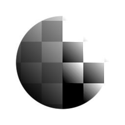

# Contrast/Luminosity

<table>
<tr style="border: 0;">
<td style="border: 0;" valign="top">

{width="128px"}

{width="128px"}

## Contrast/Luminosity (Grayscale)

**In:** *Filters/Adjustments*

**Simple**

</td>
<td style="border: 0;" valign="top">

## Description

A simple contrast and luminosity (brightness) adjustment.

## Parameters

* **Contrast**: *-1.0 - 1.0*  
  Adjusts the contrast of the result.
* **Luminosity**: *-1.0 - 1.0*  
  Adjusts the luminosity (brightness) of the result.

## Example Images

</td>
</tr>
</table>
