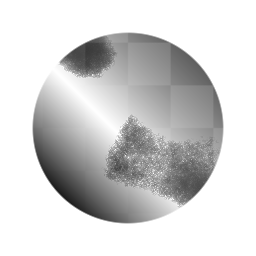

# Histogram Scan Non-Uniform

<table>
<tr style="border: 0;">
<td style="border: 0;" valign="top">

{width="128px"}

## Histogram Scan Non-Uniform

**In:** *Filters/Adjustments*

**Complex**

</td>
<td style="border: 0;" valign="top">

## Description

Advanced version of [Histogram Scan](../histogram-scan/histogram-scan.md), with additional controls and input to drive the effect on a per-pixel level, rather than uniformly across the whole image. Can be used to achieve even more intricate contrast and transitions in masks.

It's a lot more complex to use than the regular [Histogram Scan](../histogram-scan/histogram-scan.md), so make sure you are familiar with that before attempting to use the Non-Uniform version.

## Parameters

### Inputs

* **Input**: *Grayscale Input*Source result to modify.
* **Position Map**: *Grayscale Input*Input slot to drive Position parameter. Activated when "Use Position Input" is set to True. Effective value range is small and depends on Contrast map and setting.
* **Contrast Map**: *Grayscale Input*Input slot to drive contrast parameter. Activated when "Use Contrast Input" is set to True. Effective value range is small.

### Parameters

* **Use Position Input**: *False/True*Toggle use of Position Map input slot.
* **position**: *0.0 - 1.0*Controls or modifies map results to drive the position setting.
* **Use Contrast Input**: *False/True*Toggle use of Contrast Map input slot.
* **contrast**: *0.0 - 1.0*Controls or modifies map results to drive the contrast setting.

## Example Images

</td>
</tr>
</table>
