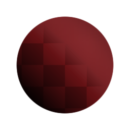

# Lighting Cancel High Frequencies

<table>
<tr style="border: 0;">
<td style="border: 0;" valign="top">

{width="128px"}

## Lighting Cancel High Frequencies

**In:** *Filters/Adjustments*

**Simple**

</td>
<td style="border: 0;" valign="top">

## Description

Similar to [Highpass](../highpass/highpass.md), but more suited for full color images (it doesn't desaturate the result as much), this node tries to cancel out high frequency, small lighting details.

Also see [Lighting Cancel Low Frequencies](../lighting-cancel-low-fre/lighting-cancel-low-frequencies.md), and the more advanced, recommended [Luminance Highpass](../luminance-highpass/luminance-highpass.md).

## Parameters

* **Intensity**: *0.0 -* 1.0  
  Strength of the lighting cancel effect.
* **Radius**: *0.0 - 10.0*Radius or size of the lighting details to cancel.

## Example Images

| 

 |
| --- |
|  |

</td>
</tr>
</table>
