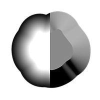
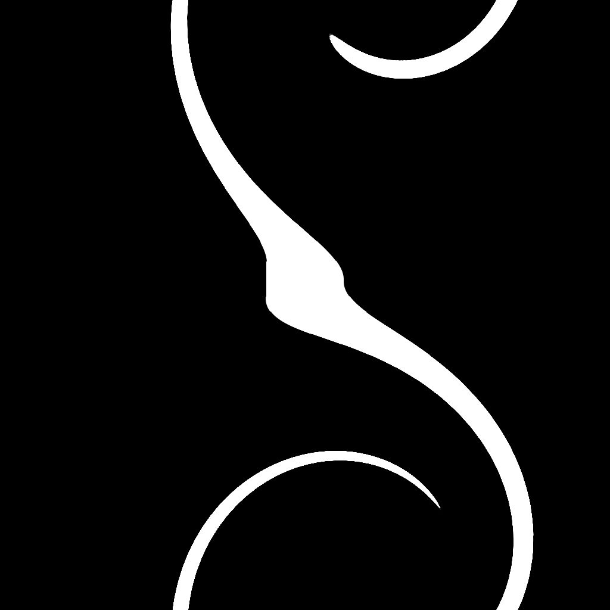
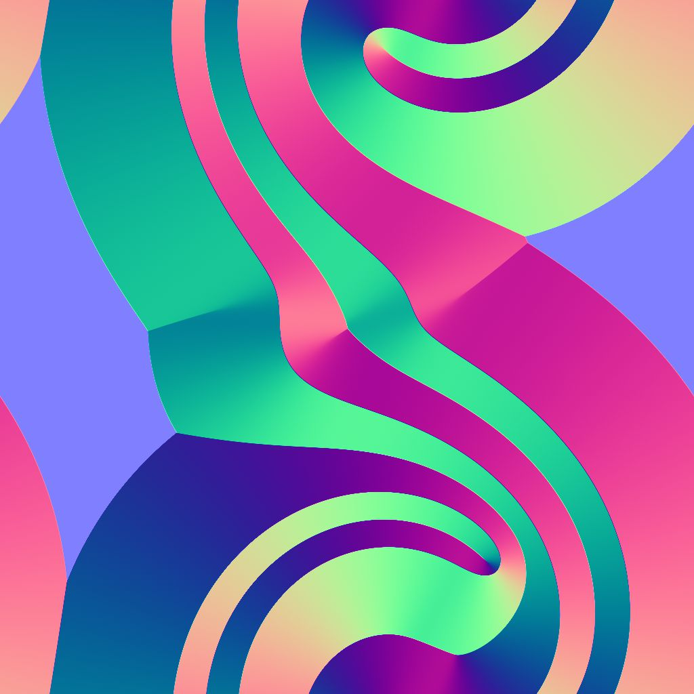

# Bevel smooth

<table>
<tr style="border: 0;">
<td width="33.33%" style="border: 0;" valign="top">

{width="200px"}

<b>In:</b> Filters &gt; Effects

</td>
<td width="100.00%" style="border: 0;" valign="top">

## Description

Draws a gradient or a flat color from the borders of a mask outward, inward or both.

Overlapping gradients are sorted by inverted normalized distance so that the distance to the closest border is drawn.

The distance of the gradient can be dynamically adjusted along the border using a distance map.

</td>
</tr>
</table>

>[!TIP]
>
> The [Directional distance](../directional-distance/directional-distance.md) node offers similar capabilities, where the dilation is performed in a specific direction.

<table>
<tr style="border: 0;">
<td style="border: 0;" valign="top">

</td>
<td style="border: 0;" valign="top">

</td>
<td style="border: 0;" valign="top">

</td>
</tr>
</table>

## Input connectors

|  |  |
| --- | --- |
| <b>Mask input</b> *Grayscale* PRIMARY | The image from which the mask should be extracted.   All values above the 'Mask Threshold' value are white in that mask. |
| <b>Source input</b> *Grayscale* | An optional input only used when the 'Output Mode' parameter is set to 'Dilation'.   In that case, this image is overlaid on the white areas of the mask, and the grayscale values at the borders are dilated. |
| <b>Distance map</b> *Grayscale* | An optional input used when the value of the 'Distance Map Multiplier' parameter is higher than 0.   It is used to adjust the beveling/dilation distance along the borders of the mask, where a darker value results in a shorter distance. |

## Output connectors

|  |  |
| --- | --- |
| <b>Output</b> *Grayscale* | The result image, according to the selected 'Output Mode'. |
| <b>UV</b> *Color* | A UV map where the UVs are dilated along the mask borders.   This can be connected to a [UV Mapper](../../../spline-paths-tools/spline-tools/uv-mapper-color/uv-mapper-color.md) node to map any other image using these dilated UVs. |

## Parameters

|  |  |
| --- | --- |
| <b>Output mode</b> *Integer* | The method of dilating the mask borders:<ul data-preserve-html="true"> <li data-preserve-html="true"><b>Bevel:</b> draw a gradient from 1 to 0 where 0 is reached at the Maximum 'Distance'</li> <li data-preserve-html="true"><b>Dilation:</b> draw a solid color as far as the 'Maximum Distance'. This color is white or the color 'Source Input' image at the mask border, if connected</li> <li data-preserve-html="true"><b>Distance:</b> the raw distance from the closest mask border, in normalized image space where 1 is the length of the shortest side of the image</li> </ul> |
| <b>Direction</b> *Integer*   *Available when 'Output mode' is set to 'Bevel' or 'Dilation'* | The side of the mask border which should be dilated:<ul data-preserve-html="true"> <li data-preserve-html="true"><b>In:</b> draw towards the interior of the mask</li> <li data-preserve-html="true"><b>Out:</b> draw towards the exterior of the mask</li> <li data-preserve-html="true"><b>In/Out:</b> draw towards both the interior and exterior of the mask</li> </ul> |
| <b>Maximum distance</b> *Float* | The distance of dilation, in normalized image space where 1 is the length of the shorter side of the input image. |
| <b>Mask smoothness</b> *Float* | The intensity of the smoothing applied to the mask.   The value is the radius of the blur, and 1 unit is 1/256th of the image. |
| <b>Mask offset</b> *Float* | Moves the mask borders inward or outward. |
| <b>Mask threshold</b> *Float* | The value used to detect the borders of the mask in the 'Mask Input' image.   Values above this threshold are the *inside* of the mask shapes, while values below are the *outside*. |
| <b>Scale</b> *Float2* | Adjusts the horizontal (X) and vertical (Y) distance of the dilation.   These values are multipliers for the 'Maximum Distance' parameter value. |
| <b>Distance map multiplier</b> *Integer* | Adjusts the impact of the 'Distance Map' over the 'Maximum Distance'. |

## Examples

<table>
<tr style="border: 0;">
<td style="border: 0;" valign="top">

{width="1024px" zoomable="yes"}

</td>
<td style="border: 0;" valign="top">

{width="1024px" zoomable="yes"}

</td>
</tr>
</table>

<table>
<tr style="border: 0;">
<td style="border: 0;" valign="top">

<table>
  <tr>
    <td>
      
       <i>Before</i>
    </td>
    <td>
      
       <i>After</i>
    </td>
  </tr>
</table>

</td>
<td style="border: 0;" valign="top">

<table>
  <tr>
    <td>
      
       <i>Before</i>
    </td>
    <td>
      
       <i>After</i>
    </td>
  </tr>
</table>

</td>
</tr>
</table>

<table>
<tr style="border: 0;">
<td style="border: 0;" valign="top">

<table>
  <tr>
    <td>
      
       <i>Before</i>
    </td>
    <td>
      
       <i>After</i>
    </td>
  </tr>
</table>

</td>
<td style="border: 0;" valign="top">

<table>
  <tr>
    <td>
      
       <i>Before</i>
    </td>
    <td>
      
       <i>After</i>
    </td>
  </tr>
</table>

</td>
</tr>
</table>

<table>
  <tr>
    <td>
      
       <i>Before</i>
    </td>
    <td>
      
       <i>After</i>
    </td>
  </tr>
</table>
