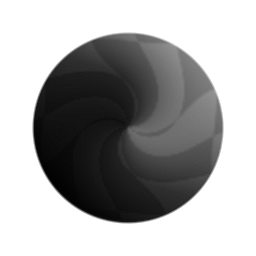
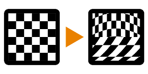

# Vector Warp

<table>
<tr style="border: 0;">
<td style="border: 0;" valign="top">

{width="128px"}

{width="128px"}

## Vector Warp (Grayscale)

**In:** *Filters/Effects*

**Complex**

</td>
<td style="border: 0;" valign="top">

## Description

Vector warp is an advanced distortion effect, similar to [Warp](../../../../atomic-nodes/warp/warp.md) and [Directional Warp](../../../../atomic-nodes/directional-warp/directional-warp.md), with the main difference being that it is driven by a (color) vector bitmap rather than a grayscale map. This means it is more powerful and versatile than its atomic node cousins.

The Vector Map is similar to a Normalmap, but it does not need to be normalised and only the R and Green (X and Y) channel are used. Blue and Alpha channels can be left black if you want. Constructing a good Vector Map can be the biggest challenge in using this node; you can either [convert grayscale maps to Normal](../../../../atomic-nodes/normal/normal.md), or construct the map by combining channels with[ RGBA Merge.](../../channels/rgba-merge/rgba-merge.md) Alternatively, something like a ["Flow Map"](../../../../../../../substance-3d-painter/painting/advanced-channel-painting/flow-map-painting/flow-map-painting.md) is also useable.

This node can be useful when you want to do very specific distortions with varying directions, where standard Warp nodes don't cut it.

## Parameters

### Inputs

* **Input**: *Color Input*   
  Map to distort.
* **Vector Map**: *Color Input*   
  Distortion driver map. Color channels Red and Blue are used.

### Parameters

* **Intensity**: *0.0 - 1.0*Intensity multiplier for the Vector Map.
* **Vector Format**: *DirectX, OpenGL*Swaps the Green channel between Up and Down interpretation.

## Example Images

| 

 |
| --- |
|  |

</td>
</tr>
</table>
