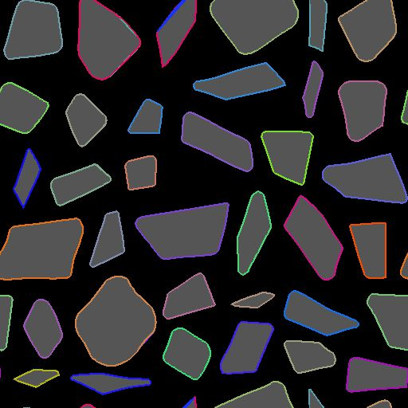
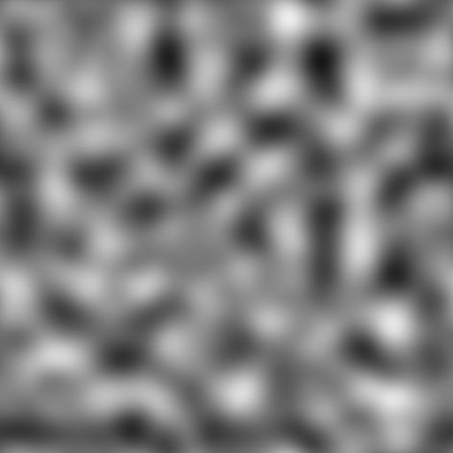

# Mask to Paths

<table>
<tr style="border: 0;">
<td width="33.33%" style="border: 0;" valign="top">

<b>In:</b> Spline &amp; Path Tools &gt; Path Tools

</td>
<td width="100.00%" style="border: 0;" valign="top">

## Description

Converts a grayscale input pattern <b>Mask</b> into a list of path segments encoded in the output <b>Paths</b>.

Controls over the start position of generated paths as well as their order in the list are available.

The generated Paths can be further processed using dedicated nodes – E.g., [Path 2D Transform](../path-2d-transform/path-2d-transform.md), [Paths Warp](../paths-warp/paths-warp.md) – or converted into splines using the [Path to Spline](../paths-to-spline/paths-to-spline.md) node to map or scatter shapes along them.

</td>
</tr>
</table>

>[!NOTE]
>
> The method used to encode Paths is explained in the [Paths Format Specifications](../paths-format-spe/paths-format-specifications.md) page.

## Input connectors

<b>Mask</b> *Grayscale*  
The input pattern which should be converted into a list of Paths.

## Output connectors

<b>Preview</b> *Color*A preview composited on top of the mask to help visualizing the effects of the parameters.

<b>Paths</b> *Color*  
A list of paths encoded in a color image. each path describes a list of encoded segments.  
The result can be processed using another Paths-processing node, or sent to a [Paths to Spline](../paths-to-spline/paths-to-spline.md) node to further process it as Splines.

## Parameters

<b>Smooth Mask</b> *Float*  
Apply smoothing on the input mask.  
Useful when the input pattern has very sharp edges, which usually causes artifacts.

<b>Mask Threshold Value</b> *Float*The grayscale value of <b>Mask</b> that will be used to separate the outside (values &lt; Mask Threshold Value) and the inside (values &gt; Mask Threshold Value) of the shape.

<b>Decimate Path</b> *Float*Implicitly controls the amount of segments that will be generated.  
A high amount of decimation will make round shapes somewhat polygonal, while no decimation will generate almost one segment by pixel.  
A reasonable amount will better match the shape of both straight lines and curves without creating a lot of intermediary points for straight lines.

<b>Close opened Paths</b> *Boolean*Create a segment between the start and the end vertices of open paths.  
Disabling this may fix undesirable lines traversing your pattern in an unexpected way, however paths may not be closed anymore.

<b>Corner Threshold</b> *Float*  
Each vertex encoded in paths can hold a flag indicating whether it is hard (I.e., a corner) or smooth.  
This parameter lets you mark more or less corners according to the angle between their adjacent segments.  
*Note:* This 'corner' flag is currently not supported by any existing node but are available to be used in a [Path Vertex Processor](../paths-vertex-processor/paths-vertex-processor.md) node. You may also visualize the corners with the [Preview Paths](../preview-paths/preview-paths.md) node.

<b>Path Startup Mode</b> *Integer*The method of selecting which vertex should be the start of each generated Path around the shapes in the Mask.  
This has a significant impact when converting the generated <b>Paths to Splines</b> using the dedicated node, as multiple Spline nodes use the Splines' start and end.  
*- Most acute vertex:* The vertex forming the lowest angle with its previous and next vertices  
*- Vertex at extreme of a specified direction:* The last vertex in a given direction  
*- Vertex closest to a specified position  
* Vertex farthest from a specified position  
* Custom startup function:* Use a custom function to select the vertex which should be used as the start each Path

<b>Startup Direction</b> *Float*The angle describing the direction used to select the startup vertex. For each Path, the last vertex in this direction is selected.  
The value is a *number of turns* used to rotate an X-leftdirection vector. This means 0 sets a direction vector of (-1, 0), and 0.25 (90 degrees) sets a direction vector of (0, 1).  
*Note:* This parameter is available when <b>Path Startup Mode</b> is set to 'Vertex at extreme of a specified direction'

<b>Startup Target Position</b> *Float2*The position in the image used to select the startup vertex.  
For each Path, the vertex closest to or farthest from this position is selected, according to the selected <b>Path Startup Mode</b>.  
*Note:* This parameter is available when <b>Path Startup Mode</b> is set to 'Vertex closest to a specified position' or 'Vertex farthest from a specified position'

<b>Startup Function</b> *Float*The function used to select the startup vertex. It returns a Float value.  
For each vertex, the function is executed and the vertex for which the function returns the *highest result* is selected.  
Available variables:  
*-* vertex.cornerness(Float)*:* The score of the vertex as a candidate to be a corner  
*-* vertex.pos(Float2)*:* The vertex position in image space  
*Note:* This parameter is available when Path Startup Mode is set to 'Vertex closest to a specified position' or 'Custom startup function'

<b>Order Mode</b> *Integer*The method of ordering the generated Paths.  
The position or size Paths' *bounding box* (Bbox) may be used as a criterion for ordering the Paths.  
This has a significant impacts when converting the generated <b>Paths to Splines</b> using the dedicated node, as multiple Spline nodes use the Splines' order.  
*- Legacy (fast):* The method used in the previous version of this node, which offers significantly better performance  
*- By Bbox center position along direction:* Paths are ordered according to the position of the center of their Bbox, from first to last along the specified direction  
*- By Bbox Bbox top-left position along direction:* Paths are ordered according to the position of the top-left corner of their Bbox, from first to last along the specified direction  
*- By Bbox size - Largest to smallest:* Paths are ordered according to the size of their Bbox, from largest to smallest  
*- By Bbox size - Smallest to largest:* Paths are ordered according to the size of their Bbox, from smallest to largest  
*- Custom ordering function:* Use a custom function to order Paths

<b>Ordering direction</b> *Float*The angle describing the direction used to order the Paths from first to last along that direction.  
The value is a *number of turns* used to rotate an X-left direction vector. This means 0 sets a direction vector of (-1, 0), and 0.25 (90 degrees) sets a direction vector of (0, 1).

<b>Ordering function</b> *Float*The function used to order the Paths. It returns a Float value.  
Paths are ordered in *ascending order* according to this function's value. In other words, the result of the function for each Path is the *sorting key* used to order the Paths.  
Available variables:  
* bbox.center (Float2): The position of the Path Bbox's center  
* bbox.topleft (Float2): The position of the Path Bbox's top-left corner  
* bbox.size (Float2): The size of the Path Bbox (X: width, Y: height)

## Examples

<table>
<tr style="border: 0;">
<td style="border: 0;" valign="top">

<table>
  <tr>
    <td>
      
       <i>Before</i>
    </td>
    <td>
      
       <i>After</i>
    </td>
  </tr>
</table>

</td>
<td style="border: 0;" valign="top">

<table>
  <tr>
    <td>
      
       <i>Before</i>
    </td>
    <td>
      
       <i>After</i>
    </td>
  </tr>
</table>

</td>
</tr>
</table>

<table>
<tr style="border: 0;">
<td style="border: 0;" valign="top">

{zoomable="yes"}

</td>
<td style="border: 0;" valign="top">

{zoomable="yes"}

</td>
</tr>
</table>

<table>
<tr style="border: 0;">
<td style="border: 0;" valign="top">

{zoomable="yes"}

</td>
<td style="border: 0;" valign="top">

{zoomable="yes"}

</td>
</tr>
</table>
