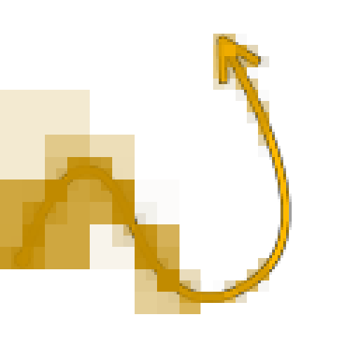
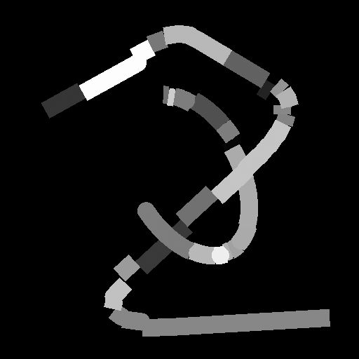
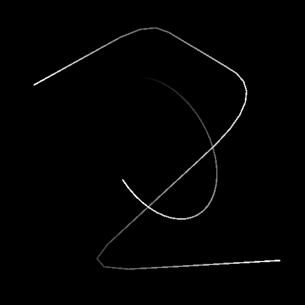

# Spline Render

<table>
<tr style="border: 0;">
<td style="border: 0;" valign="top">

<table>
<tr style="border: 0;">
<td width="33.33%" style="border: 0;" valign="top">

<b>In:</b> Spline &amp; Path Tools &gt; Spline Tools

</td>
<td width="100.00%" style="border: 0;" valign="top">

## Description

Draws strings of segments along the input <b>Splines</b> over the input <b>Background</b>.

</td>
</tr>
</table>

## Input connectors

<b>Background</b>*Grayscale*The grayscale image over which splines should be drawn.

<b>Spline Coords</b> *Color*The coordinates of the input splines’ points encoded in the RGBA channels of a color image:  
<b>    R</b> - X position  
<b>    G</b> - Y position  
<b>    B</b> - Height  
    <b>A</b> - Packed data:  
        * Sign: Spline is closed (negative) or open (positive);  
        * Absolute value: Thickness + 1.

<b>Spline Data</b> *Color*Additional data of the input splines encoded in the RGBA channels of a color image.  
<b>    R</b> - Tangents X  
<b>    G</b> - Tangents Y  
<b>    B</b> - Unused  
<b>    A</b> - Unused

<b>Spline Amount</b> *Integer*The number of input splines.

## Output connectors

<b>Output</b> *Grayscale*  
The result image of drawing the input Splines on top of the Background.

## Parameters

<b>Mode</b> *Integer*The method of selecting which splines should be drawn:  
* *Draw Spline List*: Draw all splines in the input list;  
* *Draw Single Spline*: Draw only the specified spline from the input list;  
* *Draw Spline Range*: Draw only the splines in the specified range from the input list.

<b>Draw Spline Index</b> *Integer* (Available when ‘Mode’ is set to ‘Draw Single Spline’)The index of the spline that should be drawn.

<b>Draw Spline Range</b> *Integer2* (Available when ‘Mode’ is set to ‘Draw Spline Range’)The range of indexes for the splines that should be drawn.

<b>Show Direction Helper</b> *Boolean*For each spline, draws a dot at the start of the spline and an arrowhead at its end.

<b>Segments Amount</b> *Integer*Adjusts the number of segments drawn along the splines.  
A higher value results in smoother lines.

<b>Envelope Spline Amount</b> *Integer*  
The number of duplicate segments that should be drawn along each spline’s thickness.

<b>Start</b> *Float*Offsets the start of the portion of the spline which should be drawn.  
The value represents the normalized length of the spline.

<b>End</b> *Float*Offsets the end of the portion of the spline which should be drawn.  
The value represents the normalized length of the spline.

<b>Thickness Size Mode</b> *Integer*The method of computing the thickness of the drawn segments:  
* *Image*: the value is normalized in texture space, where 1 is the full width of the image. Thickness is relative to the texture resolution;  
* *Pixel*: the value is an absolute number of pixels in the texture, where 1 is a full pixel. Thickness is separate from the texture resolution.

<b>Thickness (image)</b> *Float* (available when ‘Thickness Size Mode’ is set to Image)The thickness of the drawn segments normalized in texture space, where 1 is the full width of the image.

<b>Thickness (px)</b> *Float* (available when ‘Thickness Size Mode’ is set to Pixel)The thickness of the drawn segments as an absolute number of pixels in the texture, where 1 is a full pixel.

<b>Enable Joints</b> *Boolean*Fills the gaps between the individual segments drawn along the splines, using discs.

<b>Non-Square Correction</b>*Boolean*Adjust the points’ positions and thickness to retain the spline shape in non-square resolutions.  
This also impacts uniform distribution.

+++Color

Background IntensityFloatThe value multiplied against the Background input image.

Spline StyleIntegerThe method used to color the splines:-Solid: The segments are drawn using a uniform grayscale value;-Gradient: A gradient from black to white is applied along each string of segments from start to end;-Height: The height of the splines is used as the grayscale value for drawing the segments.

Spline ColorFloatThe uniform grayscale value used to draw the segments.When a Spline Style other than ‘Solid’ is selected, this color is multiplied against the styled color.

Random LuminanceFloatFor each string of uncut segments in a spline, applies a random offset in the specified range to the grayscale value used to draw that string.

Blend ModeIntegerThe method of blending the colors of the background and overlapping segments drawn along the splines:-Max: The brightest value is used;-Add: The values are added together.

+++

+++Random Segments

Random Segments StartFloatAdjusts the probability that the string of segments closer to the start of the spline is cut.

Random Segments EndFloatAdjusts the probability that the string of segments closer to the end of the spline is cut.

Random OffsetFloatSets the maximum amount of displacement applied to each cut segment along its normal.This parameter has no effect when Start and End are both set to 0.

Random Offset CenterFloatOffsets the center of the random displacement applied to each cut segment along its normal.

+++

## Examples

<table>
<tr style="border: 0;">
<td style="border: 0;" valign="top">

<table>
  <tr>
    <td>
      
       <i>Before</i>
    </td>
    <td>
      
       <i>After</i>
    </td>
  </tr>
</table>

</td>
<td style="border: 0;" valign="top">

<table>
  <tr>
    <td>
      
       <i>Before</i>
    </td>
    <td>
      
       <i>After</i>
    </td>
  </tr>
</table>

</td>
</tr>
</table>

<table>
<tr style="border: 0;">
<td style="border: 0;" valign="top">

<table>
  <tr>
    <td>
      
       <i>Before</i>
    </td>
    <td>
      
       <i>After</i>
    </td>
  </tr>
</table>

</td>
<td style="border: 0;" valign="top">

</td>
</tr>
</table>

</td>
<td style="border: 0;" valign="top">

</td>
<td style="border: 0;" valign="top">

</td>
</tr>
</table>
