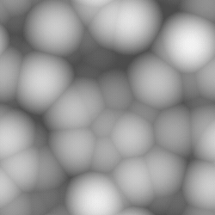
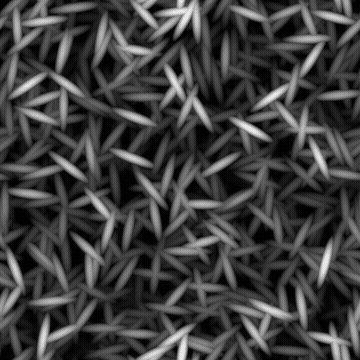

# Cells 1

<table>
<tr style="border: 0;">
<td style="border: 0;" valign="top">

<table>
<tr style="border: 0;">
<td width="33.33%" style="border: 0;" valign="top">

{width="200px"}

<b>In:</b> Texture generators &gt; Noises

</td>
<td width="100.00%" style="border: 0;" valign="top">

## Description

A variation of the <b>Cells</b> walled noises.  
  
User-selected patterns are scattered and overlaid using a Max blending mode.

See also: [Cells 2](../cells-2/cells-2.md), [Cells 3](../cells-3/cells-3.md), [Cells 4](../cells-4/cells-4.md)

</td>
</tr>
</table>

<table>
<tr style="border: 0;">
<td style="border: 0;" valign="top">

</td>
<td style="border: 0;" valign="top">

</td>
<td style="border: 0;" valign="top">

</td>
</tr>
</table>

## Outputs

|  |  |
| --- | --- |
| <b>Output</b> *Grayscale* | The generated noise as a grayscale bitmap. |

## Parameters

|  |  |
| --- | --- |
| <b>Scale</b>  Integer | The subdivision of the grid used to generate the noise tiles.    A higher value results in more tiles being drawn and a denser noise. |
| <b>Disorder</b>  Float | Displaces the ingredients of the noise.    This can be used to animate the noise. |
| <b>Disorder speed</b>  Float | Adjusts the distance of displacement applied by the <b>Disorder</b> parameter.    This can be used to control the speed of displacement when animating the noise. |
| <b>Disorder anisotropy</b>  Float | Controls the span of directions of the displacement applied by the <b>Disorder</b> parameter, where a higher value results in a narrower, more defined direction.    The direction is controlled by the <b>Disorder anisotropy angle</b> parameter. |
| <b>Disorder anisotropy angle</b>  Float | Controls the direction of the displacement applied by the <b>Disorder</b> parameter, when the 'Disorder anisotropy' parameter is not zero. |
| <b>Pattern</b>  Integer | The base shape scattered in the generated image. |
| <b>Pattern size</b>  Float2 | A multiplier for the size of a scattered pattern in its cell., where 1.0 is the full span of the cell. |
| <b>Pattern scale</b>  Float | A multiplier for the <b>Pattern size</b>, where 1.0 is the full size. |
| <b>Luminance random</b>  Float | The range of luminance randomly subtracted from the cells, where 1 is the full range. |
| <b>Angle</b>  Float | The angle used to set the direction of the cells, in number of turns and starting from horizontal right. |
| <b>Angle random</b>  Float | The maximum amout of random variation applied to the <b>Angle</b> value, in number of turns. |
| <b>Tile offset</b>  Float2 | Controls the position of the portion of infinite plane used to render the noise. |
| <b>Non-square expansion</b>  Boolean | In non-square images, keeps the generated tile square and expands the noise generation to the image's bounds. |

## Examples

<table>
<tr style="border: 0;">
<td style="border: 0;" valign="top">

{zoomable="yes"}

</td>
<td style="border: 0;" valign="top">

{zoomable="yes"}

</td>
</tr>
</table>

<table>
<tr style="border: 0;">
<td style="border: 0;" valign="top">

{zoomable="yes"}

</td>
<td style="border: 0;" valign="top">

{zoomable="yes"}

</td>
</tr>
</table>

</td>
<td style="border: 0;" valign="top">

</td>
<td style="border: 0;" valign="top">

</td>
</tr>
</table>
