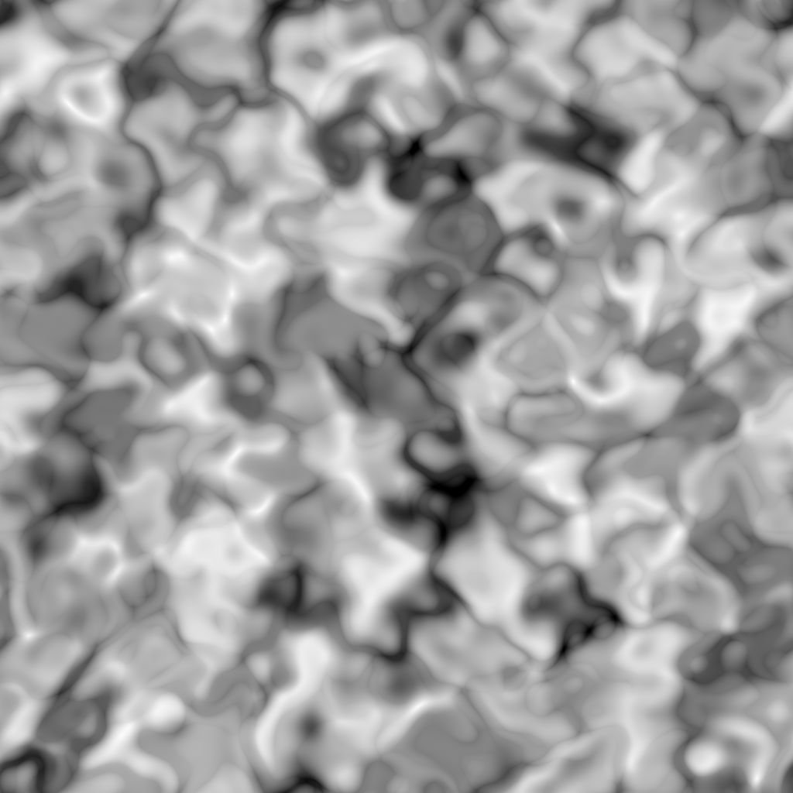

# Voronoi

<table>
<tr style="border: 0;">
<td width="41.60%" style="border: 0;" valign="top">

{width="200px"}

**In:** *Texture Generators* */Noises*

**Intermediate**

</td>
<td width="58.30%" style="border: 0;" valign="top">

## Description

The **Voronoi** node generates a 3D Voronoi noise mapped to a 2D image using a *Z-down orthographic projection*.

This node can be tested with [Cube GBuffers](../../patterns/cube-3d-gbuffers/cube-3d-gbuffers.md) as input instead of an actual baked map (as seen in the Example Image below).

>[!WARNING]
>
> This noise is meant to be used with the *GPU engine only* (i.e., **Direct**or **OpenGL**). Go to **Tools &gt; Switch engine...** or press the **F9** key to select the desired engine.

</td>
</tr>
</table>

## Parameters

* **Invert** *Boolean*   
  Inverts the output image.
* **Scale** *Float*   
  Controls the scale of the Voronoi noise.  
  *Note*: When **Tiling** is enabled on *any axis*, the scale adjustement is *stepped*. This is expected.
* **Size** *Float3*   
  Controls the size of the Voronoi noise in the **X**, **Y** and **Z** axes. Non-uniform values result in a *stretching or squashing* effect.  
  *Note*: When **Tiling** is enabled on *any axis*, the size adjustment is *stepped*. This is expected.
* **Offset** *Float3*   
  Applies an offset to the *position* of the Voronoi noise in the **X**, **Y** and **Z** axes.
* **Disorder** *Float3*   
  The intensity of the *random offset* applied to each point of the noise in the **X**, **Y** and **Z** axes.
* **Distortion Intensity** *Float*   
  Controls the intensity of a *warping effect* applied on the Voronoi noise.
* **Distortion Scale Multiplier** *Float*   
  Controls the scale of the *deforming pattern* used in the warping effect controlled by the **Distortion Intensity**.
* **Rounded Curve** *Float*   
  Rounds the *slope* around each point of the noise to make it *convex*.  
  *Note* : This parameter is not available when the **Style** parameter is set to *Edge* .
* **Distance Scale** *Float*   
  Adjusts the *distance of the gradient* around each point of the noise.
* **Distance Mode** *Integer*   
  Sets the method to *compute the distance gradient* around each point of the noise:  
  * *Euclidean*   
  * *Manhattan*   
  * *Chebyshev*   
  * *Minkowski*
* **Minkowski Number** *Float*   
  The order *p* of the Minkowski distance. If we divide the distance gradient into quadrants, this number impacts these quadrants as follows:  
  * p is *exactly* 1: Straight  
  * p is *lower* than 1: Concave  
  * p is *greater* than 1: Convex  
  Interesting values:  
  *- 1.0*: Manhattan distance  
  *- 2.0*: Euclidean distance  
  *- Infinity*: Chebyshev distance  
  *Note*: This parameter is only available when the **Distance Mode** parameter is set to *Minkowski*.
* **Style** *Integer*Sets the method *rendering the data* of the Voronoi noise, considering the noise is based on a set of points in space:  
  * *F1*: the distance to the *closest point* in space  
  * *F2*: the distance to the *second closest point* in space  
  * *F2-F1*- *F1\*F2*- *F1/F2*- *Edge*: the *edge between each cell* of the noise in space  
  * *Random color*: assign a *random flat color* to each cell of the noise in space
* **Edge Thickness** *Float*Adjusts the thickness of the edges detected between cells of the Voronoi noise. Edges are detected in the X, Y and Z axes, thus some thicknesses may increase quicker than other depending on the cells' *depth*.  
  *Note*: This parameter is only available when the **Style** parameter is set to *Edge*.
* **Random Color Seed Mode** *Integer*  
  Sets the method of *acquiring* the random seed for the color selection per cell:  
  * *Global Random Seed*: Use the seed *inherited* by the node  
  * *Manual Seed*: Use a *discrete* seed  
  *Note*: This parameter is only available when the **Style** parameter is set to *Random color*.
* **Random Color Seed** *Integer*  
  The discrete random seed which should be used for the color selection per cell.  
  *Note*: This parameter is only available when the **Style** parameter is set to *Random color* and the **Random Color Seed Mode** parameter is set to ***Manual Seed***.
* **Non Square Expansion** *Boolean*   
  Enables compensation of squash and stretch with non-square ratios.

## Example Images

<table>
<tr style="border: 0;">
<td style="border: 0;" valign="top">

{width="256px"}

</td>
<td style="border: 0;" valign="top">

{width="256px"}

</td>
<td style="border: 0;" valign="top">

{width="256px"}

</td>
<td style="border: 0;" valign="top">

{width="256px"}

</td>
<td style="border: 0;" valign="top">

{width="256px"}

</td>
<td style="border: 0;" valign="top">

{width="256px"}

</td>
</tr>
</table>
