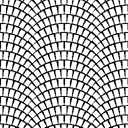

# Arc Pavement

<table>
<tr style="border: 0;">
<td style="border: 0;" valign="top">

## Arc Pavement

**In:** *Texture Generators**/Patterns*

**Intermediate**

</td>
<td style="border: 0;" valign="top">

## Description

Generates a Parisian arc pavement pattern. This effect cannot be achieved with standard [Tile Generator ](../tile-generator/tile-generator.md)or [Tile Sampler](../tile-sampler/tile-sampler.md), hence this dedicated node.

## Parameters

* **Scale**: *1 - 8*Sets global scale/tiling.
* **Pattern Amount**: *1 -* 32  
  Sets amount of bricks used in every arc.
* **Pattern Amount Random**: *0.0 - 1.0*  
  Randomises the amount of bricks in every arc. Has the added effect of giving bricks different scales.
* **Pattern Minimum Amount**: *1 - 10*  
  Controls the minimum amount of bricks when randomising arcs.
* **Arcs Amount**: *0 - 20*  
  Sets the amount of arcs stacked vertically. Changes brick height.
* **Pattern**: *Input Image, Square, Disc, Paraboloid, Bell, Gaussian, Thorn, Pyramid, Brick, Gradations, Waves, Half Bell, Ridged Bell, Crescent, Capsule, Cone*  
  Selects what pattern shape to use.
* **Input Image Filtering**: *Bilinear + Mipmaps, Bilinear, Nearest*
* **Pattern Scale**: *0.0 - 1.0*Sets scale for each tile.
* **Pattern Width**: *0.0 - 1.0*  
  Sets width for each tile.
* **Pattern Height**: *0.0 - 1.0*  
  Sets height for each tile.
* **Pattern Width Random**: *0.0 - 1.0*  
  Randomises tile width.
* **Pattern Height Random**: *0.0 - 1.0*  
  Randomises tile height.
* **Global Pattern Width Random**: *0.0 - 1.0*Randomises tile width, without creating bigger gaps between them.
* **Pattern Height Decrease**: *0.0 - 1.0*Controls squashing of tile height at the ends of every arc.
* **Color Random**: *0.0 - 1.0*  
  Randomises tile colors.
* **Non Square Expansion**: *False/True*  
  Enables compensation of squash and stretch with non-square ratios.

## Example Images

</td>
</tr>
</table>
