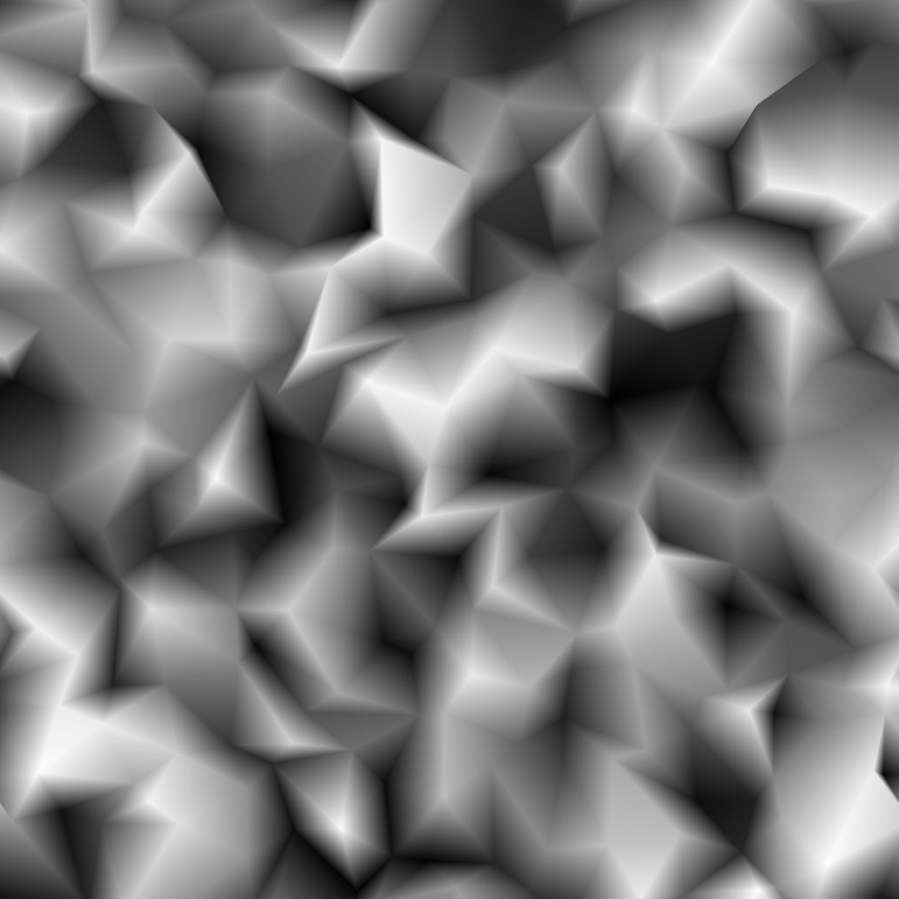
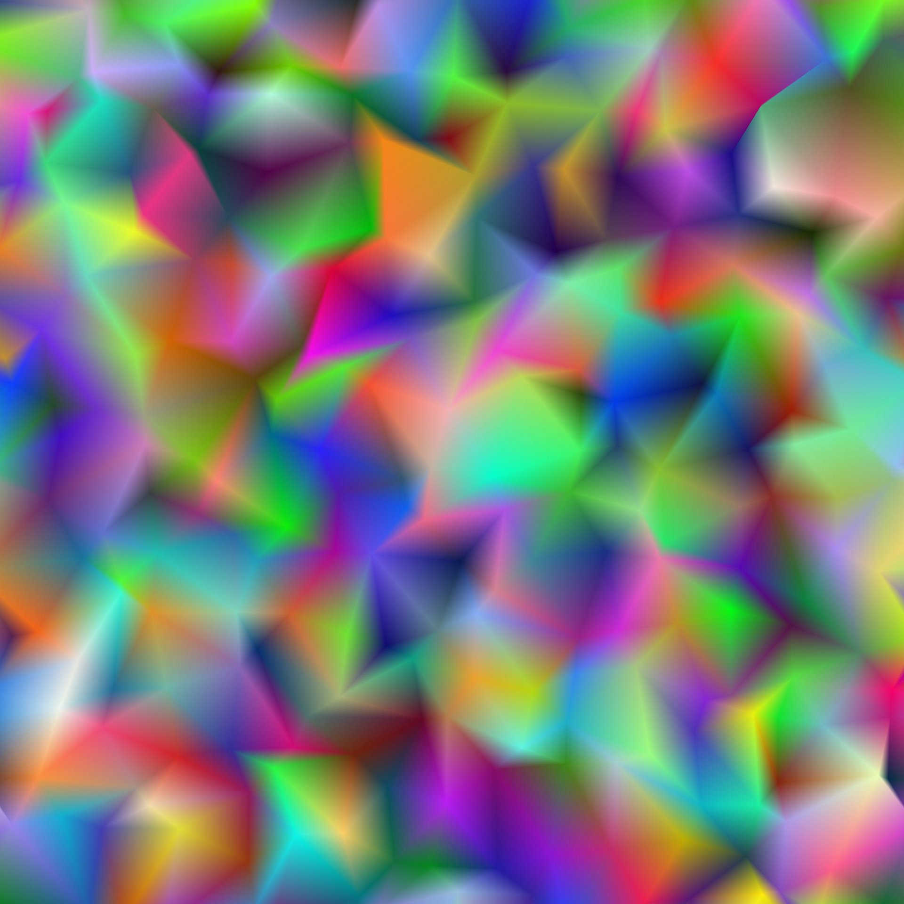
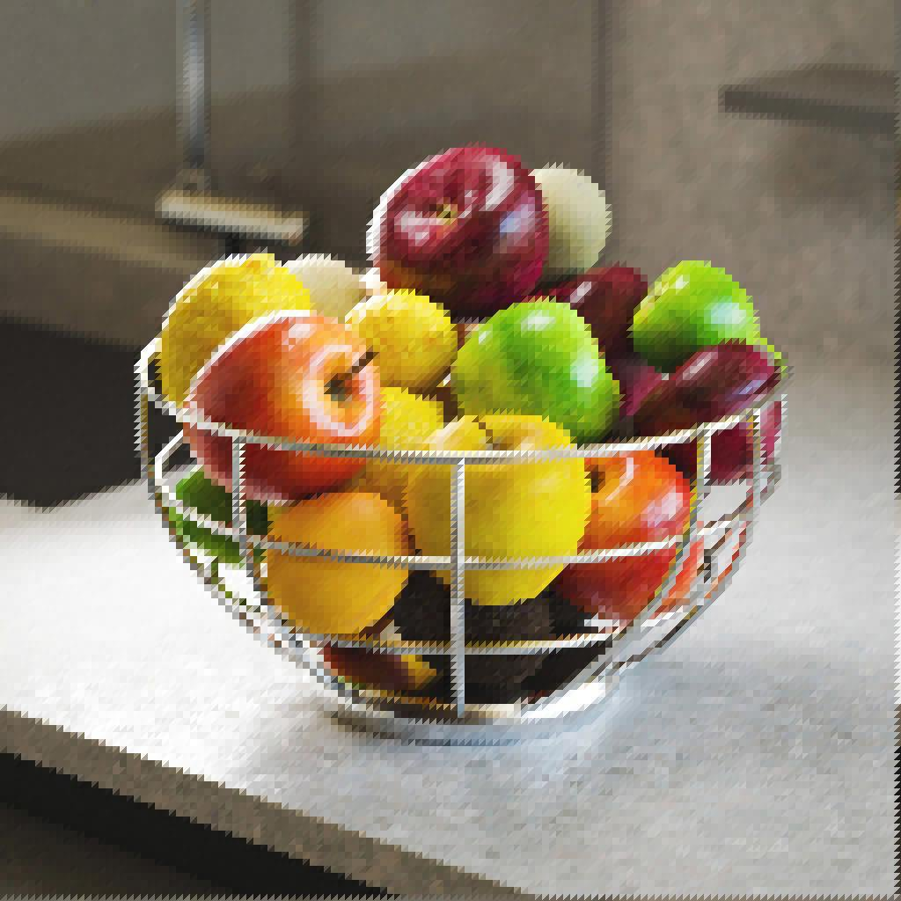
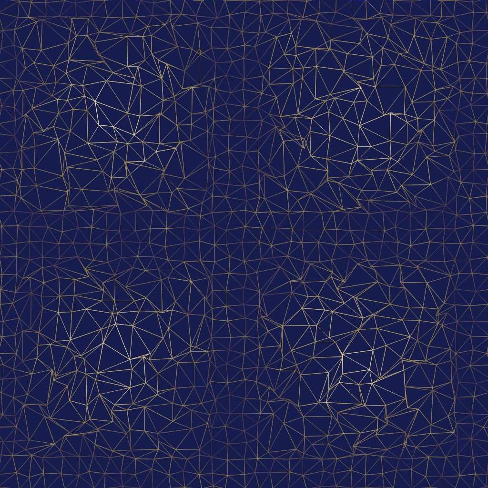
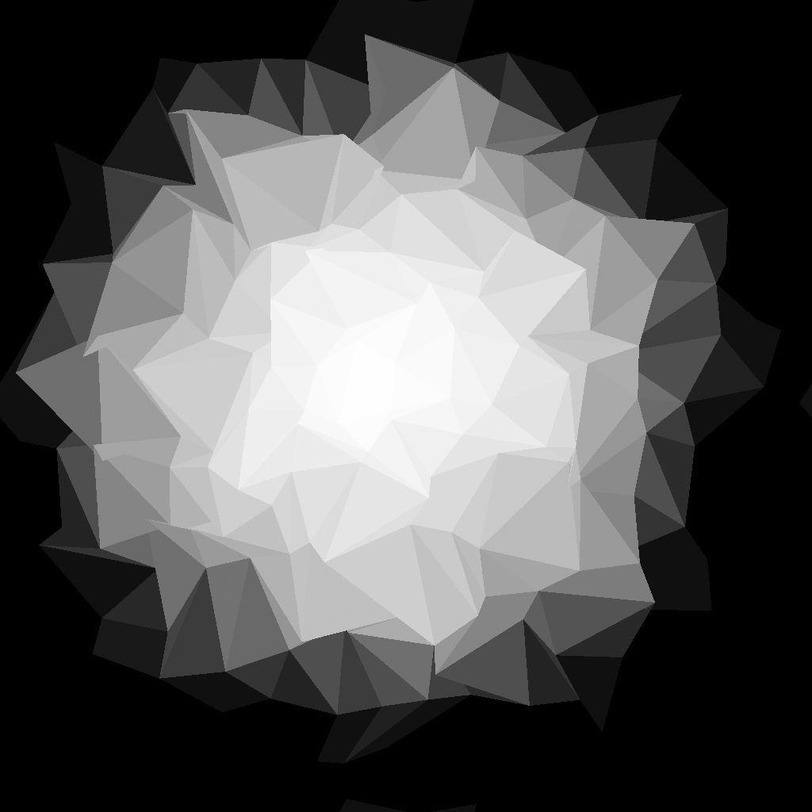
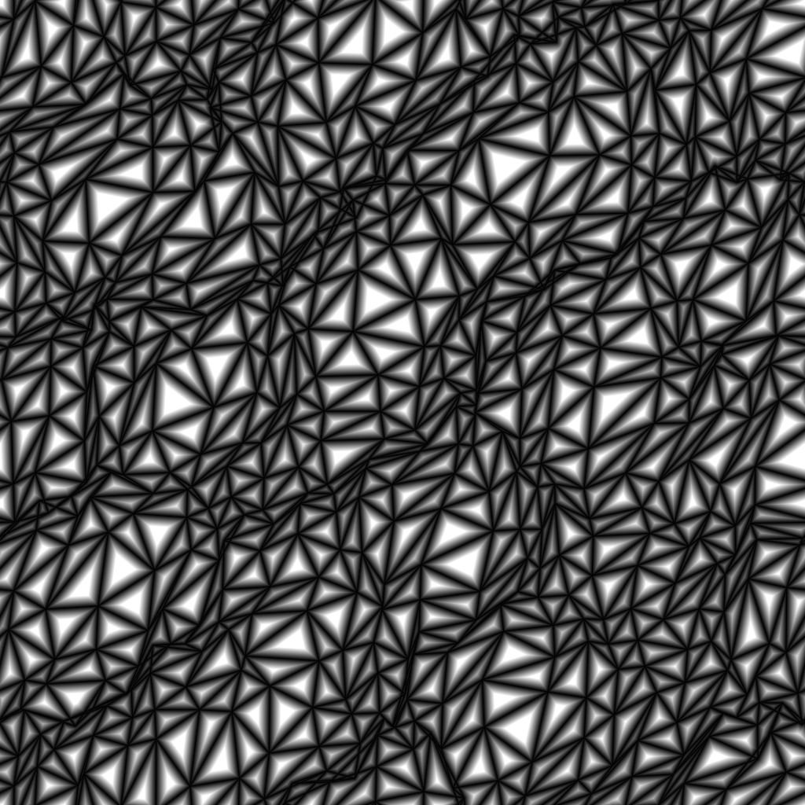
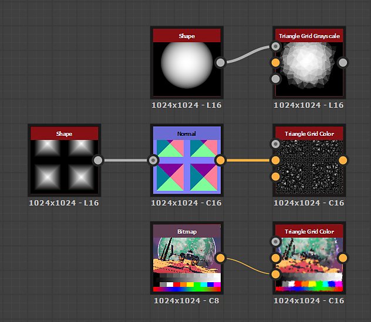

# Triangle Grid

<table>
<tr style="border: 0;">
<td width="41.60%" style="border: 0;" valign="top">

{width="200px"}

{width="200px"}

<b>In:</b> Texture Generators &gt; Patterns

</td>
<td width="58.30%" style="border: 0;" valign="top">

## Description

The **Triangle Grid** node generates a grayscale representation of a *triangulated surface* out of *vertices* in 3D space, using a Z-down orthographic projection.

The **Color Output** parameter lets you select the data used for the representation, resulting in various visual styles.  
The *positions* of the vertices may be adjusted, which impacts the generated mesh.

</td>
</tr>
</table>

<table>
<tr style="border: 0;">
<td style="border: 0;" valign="top">

</td>
<td style="border: 0;" valign="top">

</td>
<td style="border: 0;" valign="top">

</td>
</tr>
</table>

## Input connectors

|  |  |
| --- | --- |
| <b>Height</b> *Grayscale* PRIMARY | The grayscale image input used to map the *height* – i.e., Z position – of the vertices.    The influence of this input is controlled by the 'Height Input Multiplier' parameter. |
| <b>Vector map</b> *Color* | The color image input used to map the *displacement* of the vertices on the X and Y axes.    The X/Y offsets are mapped to the R/G channels of the image respectively.    The influence of this input is controlled by the 'Vector Map Displacement' parameter. |
| <b>Color input</b> *Color* | The color image input used to map the *color* of the vertices, segments or triangles.    This input is used when the 'Color Source' parameter is set to 'Color Input'. |

## Output connectors

|  |  |
| --- | --- |
| <b>Output</b> *Color* | The output image. |

## Parameters

|  |  |
| --- | --- |
| <b>Color Output</b> *Integer* | The method of representing the triangulated surface:<ul data-preserve-html="true"> <li data-preserve-html="true"><b>Per Vertex:</b> a color is assigned to each vertex and interpolated across the triangle's surface</li> <li data-preserve-html="true"><b>Per Triangle:</b> a flat color is assigned to each triangle</li> <li data-preserve-html="true"><b>Thin Line</b><b>:</b> applies an outline to the segments between vertices</li> <li data-preserve-html="true"><b>Distance to Edge</b><b>:</b> renders the distance to the closest segment on each triangle</li> <li data-preserve-html="true"><b>Center</b><b>:</b> renders the normalized distance to each triangle's barycenter</li> </ul> |
| <b>Triangulation</b> *Integer* | Sets the triangulation method for the surface, i.e. which *pair of opposing vertices* in a quad should be connected:<ul data-preserve-html="true"> <li data-preserve-html="true"><b>Auto:</b> automatically selects the pair of vertices resulting in triangles <i>facing the least away</i> from the camera  <b>45°:</b> connect opposing vertices resulting in a line <i>turned 45 degrees</i> relative to the X-right axis</li> <li data-preserve-html="true"><b>-45°:</b> connect opposing vertices resulting in a line <i>turned -45 degrees</i> relative to the X-right axis</li> <li data-preserve-html="true"><b>Quincux horizontal:</b> alternate the triangulation orientation <i>every other row</i> of vertices</li> <li data-preserve-html="true"><b>Quincux vertical:</b> alternate the triangulation orientation <i>every other column</i> of vertices  </li> </ul> |
| <b>X Amount</b> *Integer* | The amount of vertices generated on the X axis. |
| <b>Y Amount</b> *Integer* | The amount of vertices generated on the Y axis. |
| <b>Random Position Multiplier</b> *Float* | Adjusts the intensity of the main warping effect. |
| <b>Random Position</b> *Float2* | Adjusts the intensity of the random offset applied to the X and Y positions of each vertex, relatively to the *size of their cell* in the grid.   This offset *stacks* with the <b>Quincux Offset</b> and <b>Vector Map Displacement</b> parameters. |
| <b>Vector Map Displacement</b> *Float* | Adjusts the *global* amount of displacement applied to each vertex using the values *sampled* from the <b>Vector Map</b> input.    This offset *stacks* with the <b>Random Position</b> and <b>Quincux Offset</b> parameters. |
| <b>Quincux Offset X</b> *Float* | Applies the specified amount of offset to *every other row* of vertices, relatively to the *size of their cell* in the grid.   This offset *stacks* with the <b>Random Position</b> and <b>Vector Map Displacement</b> parameters. |
| <b>Quincux Offset Y</b> *Float* | Applies the specified amount of offset to *every other column* of vertices, relatively to the *size of their cell* in the grid.    This offset *stacks* with the <b>Random Position</b> and <b>Vector Map Displacement</b> parameters. |
| <b>Rotation</b> *Float* | Applies the *specified* amount of rotation to each vertex around its *base position* – i.e. its position *before* random offset and displacement is applied.    This rotation *stacks* with the <b>Rotation Disorder</b> parameter. |
| <b>Rotation Disorder</b> *Float* | Applies a *random* amount of rotation to each vertex around its *base position* – i.e. its position *before* random offset and displacement is applied.    This rotation *stacks* with the <b>Rotation</b> parameter. |
| <b>Height Input Multiplier</b> *Float* | Adjusts the Z position of each vertex using the values *sampled* from the <b>Height</b> input.    This offset *stacks* with the <b>Height Random</b> parameter. |
| <b>Height Random</b> *Float* | Applies a random offset to the Z position of each vertex.  This offset *stacks* with the <b>Height Input Multiplier</b> parameter. |
| <b>Blend Mode</b> *Integer* | Sets the method of blending the values of *overlapping triangles*. The mode lets you effectively select *which* of the triangles should be visible: <ul data-preserve-html="true"> <li data-preserve-html="true"><b>Min:</b> Text</li> <li data-preserve-html="true"><b>Max:</b> Text</li> <li data-preserve-html="true"><b>Depth Test</b>: Text</li> <li data-preserve-html="true"><b>Alpha Blend:</b> Text</li> </ul>Note: The available blending modes depend on the value of the <b>Color Output</b> parameter. |
| <b>Color Source</b> *Integer*   *Available when the 'Color Output' parameter is set to 'Per Vertex', 'Per Triangle' or 'Thin Line'.* | Sets the method of *acquiring the color* – i.e., luminance – which should be assigned to the vertex, triangle or segment, depending on the selected <b>Color Output</b> mode:<ul data-preserve-html="true"> <li data-preserve-html="true"><b>Height</b><b>:</b> use the height of the vertex as luminance</li> <li data-preserve-html="true"><b>Random</b><b>:</b> use a random luminance value</li> <li data-preserve-html="true"><b>Color Input</b><b>:</b> use the value sampled from the <b style="">Color Input</b> input</li> </ul> |
| <b>Color Source Opacity</b> *Float*   *Available when the 'Color Output' parameter is set to 'Thin Line'.* | Controls the *override* of the <b>Line Color</b> value with the values resulting from the selected <b>Color Source</b>.   Note: When this value is set to 1, the <b>Line Color</b> parameter has no impact. |
| <b>Distance to Edge Thickness</b> *Float*   *Available when the 'Color Output' parameter is set to 'Distance to Edge'.* | Sets the thickness of the distance gradient. A lower value results in a *shorter* gradient. |
| <b>Line Color</b> *Float/Float4*   *Available when the 'Color Output' parameter is set to 'Thin Line'.* | The luminance value of the segments.   Note: When the <b>Color Source Opacity</b> value is set to 1, this parameter has no impact. |
| <b>Background Color</b> *Float/Float4*   *Available when the 'Color Output' parameter is set to 'Thin Line'.* | The luminance value of the background visible between the segments.   Note: When the <b>Blend Mode</b> is set to *Max*, the background will override the segments where it is *brighter*, as expected. |
| <b>Random Color Seed Mode</b> *Integer*   *Available when the 'Color Output' parameter is set to 'Per Vertex', 'Per Triangle' or 'Thin Line' and the 'Color Source' parameter is set to 'Random'.* | The method of acquiring the seed used in the pseudo-random color distribution:<ul data-preserve-html="true"> <li data-preserve-html="true"><b>Global Random Seed</b><b>:</b> inherit the seed from the node's graph</li> <li data-preserve-html="true"><b>Manual Seed</b><b>:</b> use a custom discrete seed</li> </ul> |
| <b>Random Color Seed</b> *Integer*   *Available when the 'Random Color Seed Mode' parameter is set to 'Manual Seed' and the 'Color Source' parameter is set to 'Random'.* | The discrete seed value used in the pseudo-random color distribution. |
| <b>Non Square Expansion</b> *Boolean* | Enables compensation of squash and stretch with non-square ratios. |

## Example Images

<table>
<tr style="border: 0;">
<td style="border: 0;" valign="top">

{zoomable="yes"}

</td>
<td style="border: 0;" valign="top">

{zoomable="yes"}

</td>
<td style="border: 0;" valign="top">

{zoomable="yes"}

</td>
</tr>
</table>

<table>
<tr style="border: 0;">
<td style="border: 0;" valign="top">

{zoomable="yes"}

</td>
<td style="border: 0;" valign="top">

{zoomable="yes"}

</td>
<td style="border: 0;" valign="top">

{zoomable="yes"}

</td>
</tr>
</table>

<table>
<tr style="border: 0;">
<td style="border: 0;" valign="top">

{zoomable="yes"}

</td>
<td style="border: 0;" valign="top">

{zoomable="yes"}

</td>
</tr>
</table>
