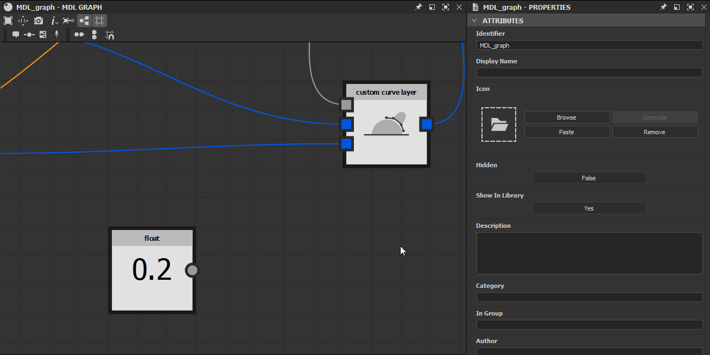
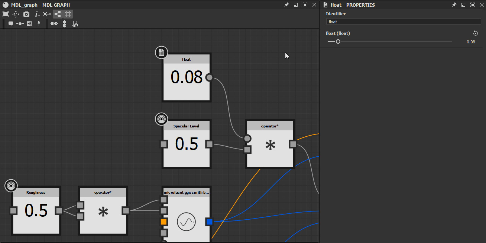

# Exposing parameters in MDL graphs

This page explains the process of exposing parameters in MDL graphs so they can be connected to values and textures provided by *other nodes* in the graph, or by *external sources*.

*Exposed state of node inputs*

## Exposing node inputs

In most cases, the *input connectors* of a node's properties can be exposed so their *value is set by other nodes* in the graph. This is a *critical* part of any workflow in MDL graphs and should be well understood.

When a node is selected in the <b>Graph view</b>, its properties are displayed in the <b>Properties</b> panel. Most properties are listed with a set of buttons to the right of their label:

* ** Copy value to a new node and link it to this parameter**: creates an *input connector* for this property and connects it to a *new node* which outputs the current value of this property
* ** Create an input pin for this parameter**: creates an *input connector* for this property
* ** Reset this parameter to its default value**: when no value is connected to this property’s input connector, resets its value to its default

*Manipulating node inputs*

Clicking any of the first two buttons results in a *typed input connector* being added to the node. The properties of the node react to the *connection status* of this connector:

* **Unconnected**: the parameter is still tweakable in the **Properties** panel and the value input in this panel is *applied*
* **Connected**: the parameter is no longer tweakable in the **Properties** panel, the value input in this panel is *replaced* by the value received by the *input connector*, the property cannot be reset to its default value

The input connector can be *removed* by clicking again on the **Create an input pin for this parameter** button. At that point, the property value returns to the value set in the **Properties** panel.

*Exposed node parameters*

## Exposing graph inputs

In MDL graph, exposing a parameter to the graph level – i.e., so it appears as an MDL material input parameter – is done by exposing the node which outputs the value.

Nodes which can be exposed have an <b>Expose</b> option in their contextual menu. In most cases, these are nodes which generate a value or data such as a Float, Color or texture coordinates.

*"Expose" option in a node's contextual menu*

The exposed parameter is configured directly in the *exposed node*, not in the graph's properties. Exposed parameters’ properties are the following:

* <b>Identifier</b>: the unique name of this input parameter in the current graph
* <b>Default value</b>: The default value for this parameter. It may also be used as a *preview* of what the input parameter will look like in Designer. The <b>Display name</b>, <b>In Group</b> and <b>Ranges</b> properties are used for the most accurate preview possible
* <b>Ranges</b>:
  * *Soft range*: Sets the default range of the widget used for displaying this parameter – e.g., a slider. This property exists for interface purposes only and values beyond the soft range can be input manually
  * *Hard range*: Sets the range of accepted values for this parameter. Values below the range are clamped to the minimum value, while values above the range are clamped to the maximum value. The parameter’s default and soft range values are *automatically adjusted* to fit within this range.
* <b>Description</b>: The description of the parameter
* <b>In group</b>: The parameters group this input parameter belongs to. If not blank, the parameter will be displayed in Designer as part of a collapsible section named after the group
* <b>Display name</b>: The parameter name displayed in the interface
* <b>Hidden</b>: When set to True, the parameter in not visible in the graph inputs and MDL material properties
* <b>Gamma type</b>: The gamma which should be used when sampling values from a texture connected to this parameter
* <b>Visible by default</b>: Sets the visibility of this parameter in MDL integrations in cases where some parameters may be hidden
* <b>Type modifier</b>: Sets whether the value is uniform or varying. When set to auto, the parameter inherits this property from its input (e.g., for a Float value: uniform when connected to a Float, varying when connected to a texture)
* <b>Sampler usage</b>: The identifier of the parameter’s usage, which is used to *connect the appropriate texture*s when multiple outputs are connected to an MDL material at once. For instance, when connecting a [Substance graph](../../compositing-graphs/substance-compositing-graphs.md) to an MDL material in the 3D view, textures are connected to the correct inputs based by matching their usage identifiers.

>[!WARNING]
>
> While graph inputs are set up a configured at the *node* level, their ordering is managed at the *graph* level in **Graph input** section of the [graph properties](../creating-an-mdl-graph/creating-an-mdl-graph.md).

*Exposing nodes into graph inputs*
