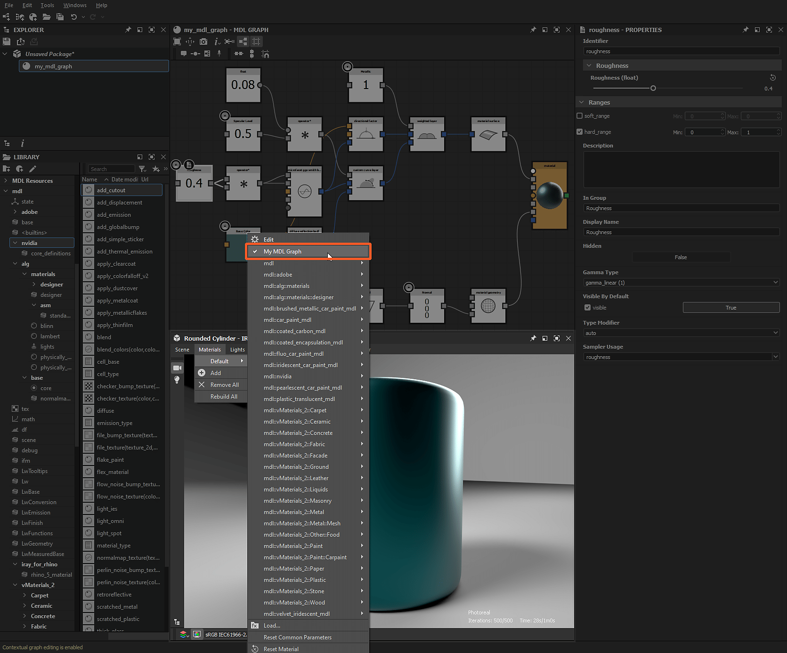

# MDL library

This page presents the library of content related to [MDL graphs](../mdl-graphs.md) and materials included in Substance 3D Designer. It also explains installing and managing custom content in the [Library](../../interface/the-library/the-library.md).

## MDL content in the Library

Nodes usable in MDL graphs are available in the <b>mdl</b> section of the [Library](../../interface/the-library/the-library.md). The nodes are arranged into filters according to the MDL module they are defined in.  
If modules are stored into subfolders, this hierarchy will be *mirrored* in the Library as *categories*.

This section includes content from the following sources:

<table>
<tr style="border: 0;">
<td style="border: 0;" valign="top">

### Built-in content

Designer includes MDL modules which contains basic building blocks for authoring MDL graphs, as well as full material definitions ready to be used.

This content is stored in this location under the installation directory : `./resources/view3d/iray/`

### Custom content

In addition to the built-in content, you may add *your own* MDL modules to the Library.

Indeed, any MDL module found under the directories listed in the <b>MDL</b> section of the [Project settings](../../interface/preferences-window/project-settings/project-settings.md) are added to this section *cumulatively* across project files.

### NVIDIA vMaterials

If NVIDIA's [vMaterials](https://developer.nvidia.com/vmaterials) library is installed, it is *automatically added* into the Library under its *own category*.

</td>
<td style="border: 0;" valign="top">

*"mdl" section in the Library, the vMaterials library and custom content are framed*

</td>
</tr>
</table>

## MDL content in the 3D View

All MDL modules available in the Library may be used in the [3D View](../../interface/3d-view/3d-view.md) when the Iray renderer is used.

Open the <b>Materials</b> menu, and open a *scene material's submenu* to browse the available MDL modules. The lists includes:

* Built-in content
* Custom content
* NVIDIA [vMaterials](https://developer.nvidia.com/vmaterials)
* Loaded [MDL graphs](../mdl-graphs.md)

*MDL materials in the 3D View*
