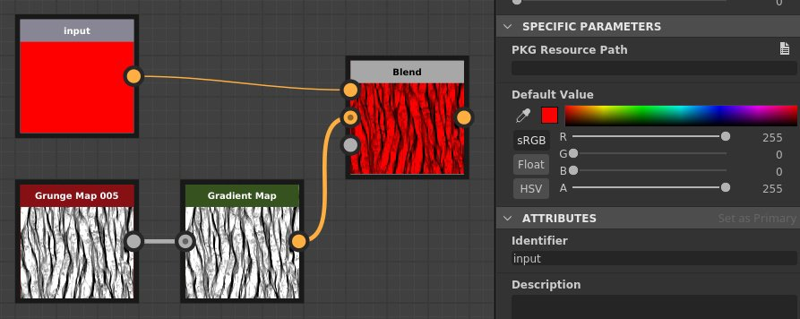
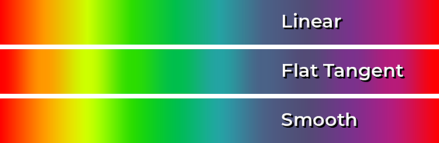
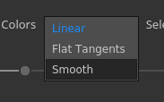
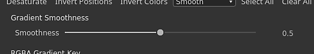
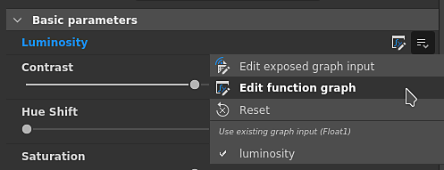
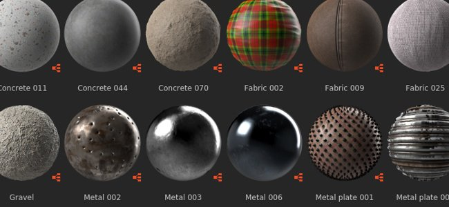
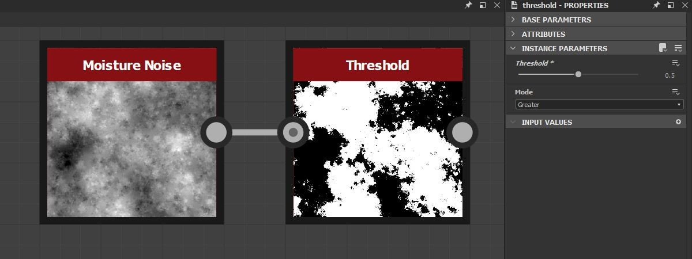
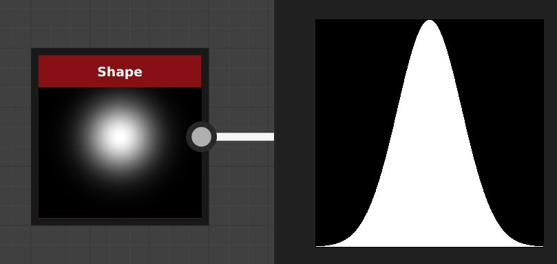
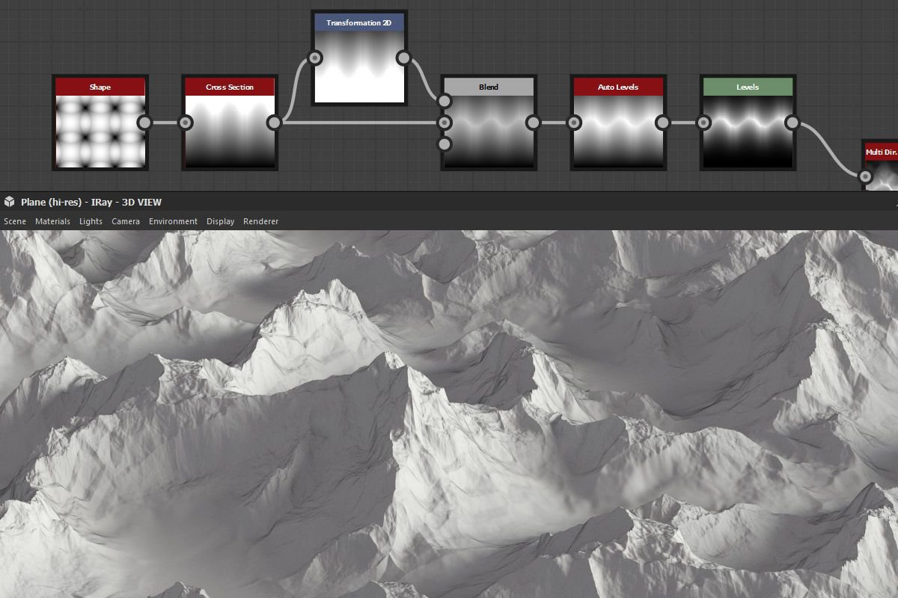

# Version 2020.2 (10.2)

**Substance Designer 2020.2** brings a new Substance Engine update, improved workflow for exposing parameters, some performance improvements and new content.

Release date: *October 12, 2020*

## Major Features

### New Engine Update (Version 8)

In this new version, the Substance Engine is now in version 8 and brings new functionalities and several improvements:

* **Default values for input images**   
  Image inputs in graph can now define a default color, making it handy to fallback on an appropriate value when nothing is loaded or connected to that input.

  {width="600px"}

* **New distance modes**   
  [The distance node](../../../compositing-graphs/nodes-reference-for-com/atomic-nodes/distance/distance.md) has now two new modes which changes the way the computation is done:

  * **Euclidean** (original mode): straight line distance between points in Euclidean geometry.
  * **Manhattan**: distance between points but constrained on a grid, similar to city blocks.
  * **Chebyshev**: maximum distance from the difference of two points on a uniform sized grid.

  {width="600px"}

* **New gradient interpolation**[The gradient node](../../../compositing-graphs/nodes-reference-for-com/atomic-nodes/gradient-map/gradient-map.md) has a new mode **Smooth** to interpolate keys which produces much more natural transitions of colors. It works by looking at neighbour keys. The previous mode **Interpolation** has been renamed to **Flat Tangent**.

  {width="600px"}

     
    
  There is also an additional parameter for the **Smooth** mode which controls the length of the Tangent used to compute the curve that blends between the colors. A value of 0 means the tangents have a length of 0, while a value or 1 means the tangents will be half of the length between two keys.

  

* **Improved Curve Node**[The curve node](../../../compositing-graphs/nodes-reference-for-com/atomic-nodes/curve/curve.md) can now directly output a grayscale image. This change makes it possible to define a curve and output it directly without the need to plug in a gradient texture first.

  

### Improved expose parameter

The workflow for exposing and editing parameters as been improved to be more straightforward:

* **Improved menu actions**Actions to expose and edit exposed parameters have been separated to be more explicit. New shortcut have also been introduced to more easily and quickly edit exposed parameters. For example there is now a dedicated button to edit the function of a parameter and a dedicated action to jump to the exposed graph parameter.

  

  

* **Configuring new parameter from the dialog directly**When exposing a parameter, all the regular controls such as the description and default values are now accessible from the **Expose Parameter** dialog. This make the configuration and creation of new Graph parameters much easier and faster, avoiding the need to go into the Graph parameter view immediately after creating a parameter.

  {width="600px"}

### Improved icon configuration for Substance graph

Setting up thumbnails in Substance graph is now much easier with the improved interface:

* **Automatic graph thumbnail generation**   
  It is now possible to generate automatically a preview for a Substance graph by simply clicking on the Generate button next to the icon in the graph parameters. It currently only supports graph using the Metallic/Roughness PBR workflow as output nodes. When generating the thumbnail the displacement intensity is computed from the Physical Size value if defined, otherwise it defaults to a value of 0.1.

  {width="600px"}

* **Adding custom thumbnails with the new buttons**   
  We added several new button to simplify the setup of custom thumbnails:

  * **Browse**: Open a file dialog to load an image. Can also be done by clicking on the folder icon next to the buttons.
  * **Generate**: See the demonstration just above.
  * **Paste**: Load an image from the clipboard.
  * **Remove**: Remove the currently assigned image for the icon.

  

### Improved Performances

Two new optimisations have been made in this new release that reduce time between iterations:

* **Improved graph computation performance**   
  Output nodes are now directly computed when requested instead of computing the intermediate nodes on the way (which is now in a second step). This change allow to preview the results of a graph much more quickly even when tweaking root nodes. In the comparison below, the this optimisation allows to see more iterations of the graph in the same time period (here with a material at a 4K resolution):

  

* **Improved Bakers dilation and diffusion generation**   
  Generating dilation and diffusion of baked textures is now up to 4 times faster than in previous versions. This reduce the waiting time between bakes.

  

### New Content

This release see this addition of a few new nodes as well as additional possibilities on some already existing ones:

* **[New Threshold filter](../../../compositing-graphs/nodes-reference-for-com/node-library/filters/adjustments/threshold/threshold.md)**This node allows to quickly isolate as a black and white mask some part of an image based on a grayscale input. This is similar in practice to the already existing Histogram Scan filter, but more convenient to use on a day to day basis. Find out more about it with the [dedicated documentation page](../../../compositing-graphs/nodes-reference-for-com/node-library/filters/adjustments/threshold/threshold.md).

  {width="650px"}

* **[New Cross Section filter](../../../compositing-graphs/nodes-reference-for-com/node-library/filters/effects/cross-section/cross-section.md)**This node allows to visualize the shape of a grayscale input as a profile, making creating heightmap and shapes much easier with this filter as a debug tool. For more information take a look at the [dedicated documentation page](../../../compositing-graphs/nodes-reference-for-com/node-library/filters/effects/cross-section/cross-section.md) .

  {width="600px"}

  {width="600px"}

* **Improved [Tile Generator](../../../compositing-graphs/nodes-reference-for-com/node-library/texture-generators/patterns/tile-generator/tile-generator.md) and** [**Tile Sampler**](../../../compositing-graphs/nodes-reference-for-com/node-library/texture-generators/patterns/tile-sampler/tile-sampler.md)  
  These two nodes now have new parameters to expand further capabilities and usages:

  * **Keep ratio**: Keep the ratio of the tiles, no need to compensate manually the size when the count on the X and Y axis is uneven.
  * **Absolute**: Keep the tile a predefined percentage of the final image’s width.
  * **Pixel**: Define the tile size in pixels.

  For more details see the [dedicated documentation page](../../../compositing-graphs/nodes-reference-for-com/node-library/texture-generators/patterns/tile-generator/tile-generator.md).

  

### Miscellaneous

**Iray** has been updated to version 2020.1.0 which adds the support of the new Ampere GPU by Nvidia (such as the RTX 3080 and RTX 3090).

## Release Notes

### 2020.2.0

*(Released October 12, 2020)*

**Added:**

* &#91;Content&#93; Add "Cross Section" node
* &#91;Content&#93; Add "Cross product vec2" function to functions.sbs
* &#91;Content&#93; Add "Get Size" value node
* &#91;Content&#93; Add "Orthogonal vec2" function to functions.sbs
* &#91;Content&#93; Add Average functions to functions.sbs
* &#91;Content&#93; Add Threshold filter
* &#91;Content&#93; Color Match: add a mask input to specify where to apply the filter
* &#91;Content&#93; Tile Generator/Sampler: add new options to control the pattern size
* &#91;Content&#93; Update PBR Render node with default value for image inputs
* &#91;Parameters&#93; Add warning icons to highlight issues in Instance Parameters
* &#91;Parameters&#93; Ignore Visible If statements for Inputs/Outputs involving parameters which have a Function applied
* &#91;Parameters&#93; Improve the UX for group association
* &#91;Parameters&#93; Rework of the way to expose a single parameter
* &#91;Parameters&#93; Highlight exposed parameters
* &#91;Parameters&#93; Improve Clean up of unused parameters
* &#91;Engine&#93; Curve node: new option to output the curve texture
* &#91;Engine&#93; Default values on input images
* &#91;Engine&#93; Distance node: new distance modes (Manhattan and Chebyshev distances)
* &#91;Engine&#93; Gradient node: new interpolation mode to have more natural mix between colors
* &#91;Engine&#93; Some parameters are now grayed out depending on other parameters
* &#91;UX&#93; Accept 6-digits RGB colours in Color Picker's hexadecimal field
* &#91;UX&#93; Avoid showing comments properties as soon as they are selected
* &#91;UX&#93; Display relevant groups when starting to write a group name
* &#91;UX&#93; Shortcut to Reexport graph outputs
* &#91;UX&#93; Make all Dropdown-textfield-comboboxes look different from regular comboboxes
* &#91;GraphRender&#93; Display nodes thumbnails one by one and not only when they are all computed
* &#91;GraphRender&#93; Improve cancellation delay during graph rendering
* &#91;GraphRender&#93; Improve the accuracy of the rendering progress bar
* &#91;Thumbnails&#93; Automatic thumbnail (icon) computation
* &#91;Thumbnails&#93; Rework of the UX to add a thumbnail (icon) to a package
* &#91;Preferences&#93; Enable GPU raytracing by default for new users
* &#91;Preferences&#93; 3DView / OpenGL / Quality: replace slider for sample counts by a more intuitive list of choices
* &#91;Bakers&#93; Improve post processes performances
* &#91;Color Management&#93; Show current working color space in preferences dialog.
* &#91;Iray&#93; Automatically switch to CPU mode when there is no compatible GPU
* &#91;Performances&#93; Improve response time to compute the node we are interested in (now computed first)
* &#91;Python API&#93; New Method addActionToExplorerToolbar to add icons to the explorer toolbar
* &#91;Resources&#93; Upgrade to FBX 2020.0.1
* &#91;iRay&#93; Update to Iray 2020.1.0
* &#91;API&#93; Add Python access to color management settings and properties

**Fixed:**

* &#91;Graph&#93; Changing the parent size or uv tile does not cancel the current render
* &#91;Graph&#93; Crash when moving an output connection then pressing Alt+LMB
* &#91;Graph&#93; Crash when moving connections in Material or Compact Material mode
* &#91;Graph&#93; Input nodes cannot preview Bitmap resources
* &#91;Graph&#93; Node compatibility broken on instances
* &#91;Graph&#93; Too many nodes are invalidated when changing a graph parameter
* &#91;Content&#93; 'Shape Extrude' output shape is flipped in specific cases: new version needed, old one is deprecated
* &#91;Content&#93; Incorrect result using Custom Color Variation in Color Match node
* &#91;Content&#93; Size by X/Y Amount Ratio in Atlas Scatter has the opposite effect
* &#91;Content&#93; Size by X/Y Amount Ratio in Shape Splatter has the opposite effect
* &#91;3D View&#93; Crash on Undo operation after loading a Scene resource from a package
* &#91;3D View&#93; Custom environment not saved in SBSSCN if path has alias with special characters
* &#91;3D View&#93; Switching Normal Format in Material settings results in flipped states
* &#91;UI&#93; 'Set as Primary' button text is overflowing from display area
* &#91;UI&#93; Main window position is not correctly restored when working in windowed mode
* &#91;UI&#93; Status bar text is offset when window is fullscreened or dragged near screen edge
* &#91;Iray&#93; Crash with "Invalid Tag" message when switching back and forth between renderers
* &#91;Iray&#93; Visible faces on non-opaque surfaces
* &#91;Presets&#93; Crash when applying presets in instances of some Substance Source graphs
* &#91;Presets&#93; wrong name displayed after undo on sbs instance
* &#91;Render&#93; Wrong render when tweaking a parameter in preview mode
* &#91;Bakers&#93; Refreshing multiple baked maps results in warnings blocking some bakes
* &#91;Cooker&#93; Tweaking SBSAR nodes in SBS instances results in 0 output from the instance
* &#91;Explorer&#93; Custom aliases are not passed along when using 'Save and open in Substance Player'
* &#91;Gradient Editor&#93; Absolute color selection does not impact all selected keys
