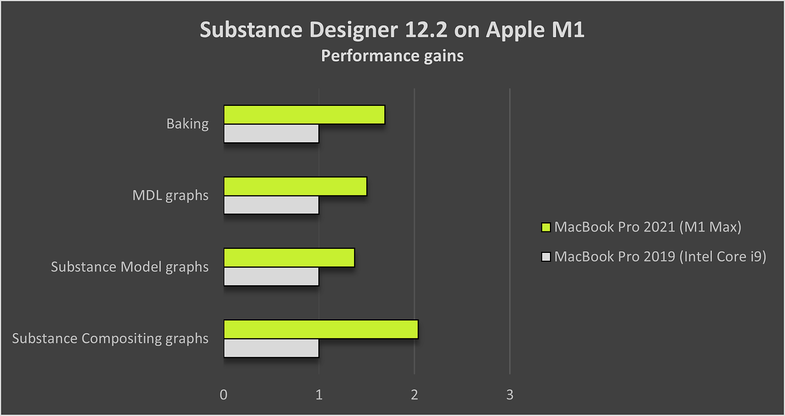
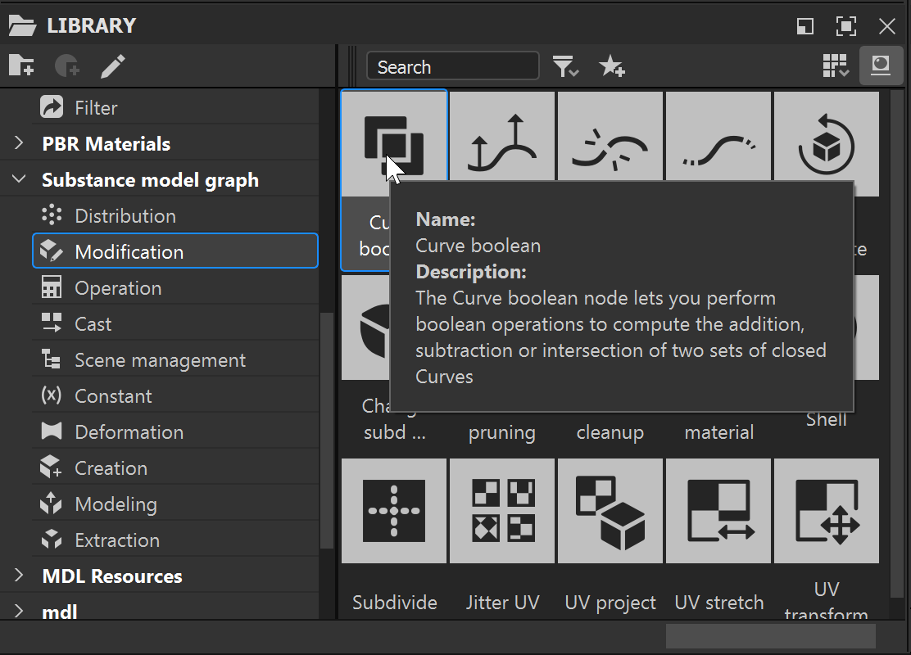
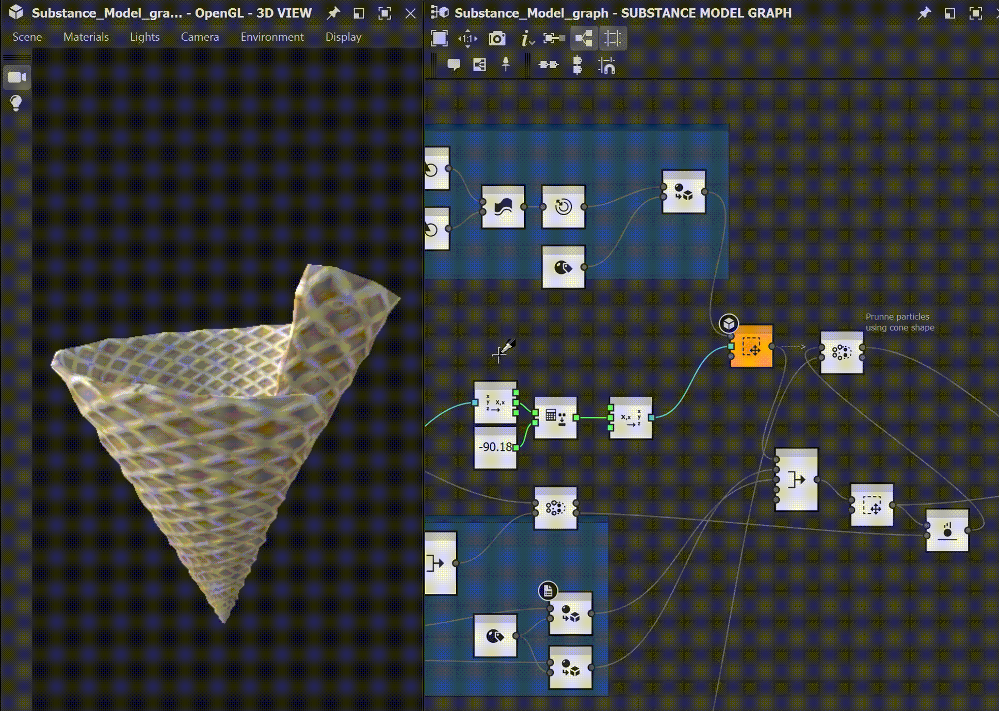

# Version 12.2

<b>Substance 3D Designer 12.2</b> brings native support of Apple silicon machines (M1), some improvements for Substance model graphs and other small updates. This page will describe all the details concerning this new version.

Release date: *July 19th, 2022*

## Major features

### Native support for Apple silicon (M1) chips

The 12.2 version of Designer is the first one with the full native support of new Apple machines based on M1 chip. Although Designer could run technically on Apple Silicon devices previously, the native support will bring you a faster and more efficient experience. As you can see on the image below, computation are *up to two times faster* with this new version on these machines.

{width="600px"}

### Improvements for Substance model graphs

* <b>Tooltips on nodes   
  </b>It is not always possible to explain what a node is doing with just an icon and a title, that is why we have now a tooltip with a *full description of the node* when you are in the Library or in the Graph View. It will help you to find the node you are looking for or to better understand what are its capabilities. 

* <b>Shortcuts for node creation  
  </b>To speed up the creation of your most used nodes, you can now define your own shortcuts in the Preferences, like for the other types of graphs.

* <b>Preview node from the node contextual menu  
  </b>In our latest release, we added the possibility to preview a node in the 3D View thanks to a keyboard shortcut (*SHIFT + Click* on a node). This feature is now also available from the *node contextual menu* in order to make it more discoverable.

  {width="600px"}
* <b>Search based on node compatibility   
  </b>When you are looking for a node from the node menu (accessible by pressing *Spacebar* in the Graph View), nodes are now correctly filtered in order to show only the ones who are *compatible with the one currently selected* in the graph. It helps you to find quickly the node you are looking for.

### Miscellaneous

* <b>2D View improvements</b>  
  Where it was possible in previous versions to view the graph's outputs in the 3D View through the Substance graph's *contextual menu*, it was not possible to view a graph output in the 2D View. This option has now been added to this menu, with a submenu listing all the graph outputs to be displayed in the 2D View.  
  The "View outputs" button in the 2D View toolbar has also been updated with a down arrow and a tooltip in order to make its behaviour clearer.  
  And finally, the option "Automatic display graph outputs when loading a graph" in the Preferences has been *split into two separate settings* – for the 2D View and 3D View respectively – in order to let you control which view should be opened and populated automatically when you load a graph.

* <b>CLO Template</b>  
  In order to improve the interoperability with CLO software, we added a *new dedicated template*. It will automatically add to your graph all the *metadata* required to correctly import your material in CLO.

  {width="600px"}

* <b>VFX Reference Platform requirements</b>  
  Every year, the VFX Reference Platform publishes a list of tools and libraries versions to be used in every software for the VFX industry to minimise incompatibilities between software. As usual, we *update all our dependencies* in order to respect all these recommendations.

## Release notes

### 12.2.0

*(Released July 19, 2022)*

<b>Added:</b>

* &#91;Apple&#93; Native Apple silicon (M1) support (Creative Cloud version only)
* &#91;Substance model graph&#93; Display node tooltips in Graph View
* &#91;Substance model graph&#93; Display node tooltips in Library
* &#91;Substance model graph&#93; Add a contextual menu entry to preview nodes
* &#91;Substance model graph&#93; Allow user to create shortcuts for nodes creation
* &#91;UI&#93; Add "View output in 2D View" option in Substance graph's contextual menu
* &#91;UI&#93; Split the "Automatic display of outputs" setting into 2D View/3D View specific settings
* &#91;UI&#93; Add dropdown arrow and tooltip to "View output" button in 2D View toolbar
* &#91;UI&#93; Reword and reorder items in Explorer's Information panel
* &#91;Color Management&#93; Add "Linear Adobe RGB (1998)" and "Adobe RGB (1998)" export color spaces for Adobe ACE
* &#91;Color Management&#93; Add "Linear Adobe RGB (1998)" working color space for Adobe ACE
* &#91;Color management&#93; Add suport for OCIO ICC displays
* &#91;Color Management&#93; Hide Adobe RGB working color space from ACE preferences
* &#91;Color management&#93; Improve quality of baked 3D LUTs in ACE mode
* &#91;Color Management&#93; Use new GPU backend in 3D viewer
* &#91;Localization&#93; Full update of Korean language
* &#91;Engine&#93; Update to version 8.6.0
* &#91;Graph&#93; Assign a default graph identifier when that property is left blank
* &#91;Library&#93; Disable tooltip hyperlinks for non-instance nodes
* &#91;NewProject&#93; Update default resolution
* &#91;Templates&#93; Add CLO template
* &#91;API&#93; Expose the defaultParentSize property for SDSBSCompGraph objects
* &#91;Dependencies&#93; Update Alembic to version 1.8.3
* &#91;Dependencies&#93; Update AXF to version 1.9.0
* &#91;Dependencies&#93; Update Boost to version 1.76
* &#91;Dependencies&#93; Update FBX to version 2020.2.1
* &#91;Dependencies&#93; Update IRay to version 2021.1.0
* &#91;Dependencies&#93; Update OpenColorIO to version 2.1.1
* &#91;Dependencies&#93; Update OpenEXR to version 3.1.5
* &#91;Dependencies&#93; Update TBB to version 2020.3
* &#91;Dependencies&#93; Update USD to version 0.22.3
* &#91;Remove&#93; Disable the post effects feature (Yebis)
* &#91;Remove&#93; Remove "Save render to Artstation" command from the 3D View menu

<b>Fixed:</b>

* &#91;Substance models&#93; Hard range set on exposed parameter is saved when unexposing
* &#91;Substance models&#93; Identifier is not user friendly on constant nodes
* &#91;Substance models&#93; Improve search based on node compatibility
* &#91;UI&#93; 'New' submenu order is incorrect for Folder resources
* &#91;UI&#93; Default size of main window is very small
* &#91;UI&#93; Toolbars are not affected by 'Reset layout' option
* &#91;UI&#93; Visible transparency grid on font resource icon in Explorer
* &#91;Cooker&#93; Substance graphs instanced in MDL graph are always entirely recooked
* &#91;Graph&#93; Crash when pasting a node copied from a graph with blank identifier
* &#91;MDL&#93; Crash when closing a specific MDL graph
* &#91;Performances&#93; Application is unresponsive when loading very large packages
* &#91;Resources&#93; 3D Scene resource can be imported in a specific case
