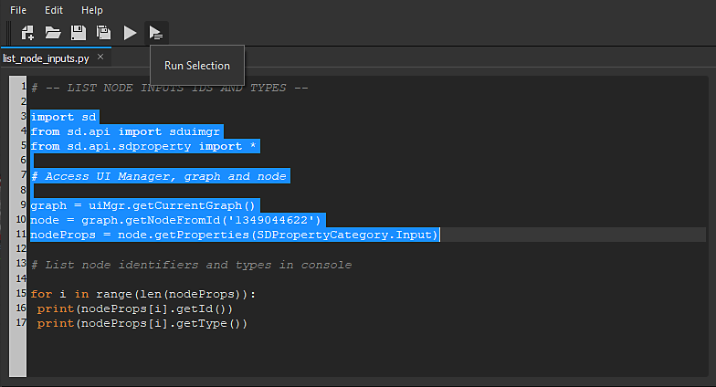

# Python Editor

Substance 3D Designer includes a **script editor**, allowing users to **test Python code** directly within Designer and get its **console output**.

The editor features a '**Find and Replace**' feature, accessible in the '*Edit &gt; Find...*' item in the editor menu bar, or by pressing *Ctrl+F*.

In the spirit of the **testing** **purposes** of the Python Editor, users can test either all the code by pressing the '*Run*' button in the editor toolbar (or by pressing *F5*), or the **current selection only** by pressing the '*Run Selection*' button (or by pressing '*Ctrl+Enter*').

