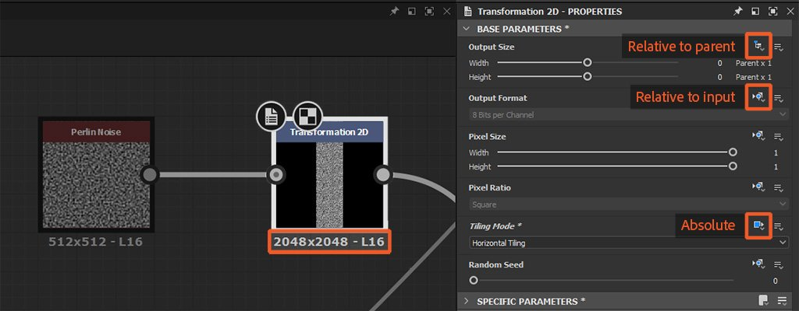
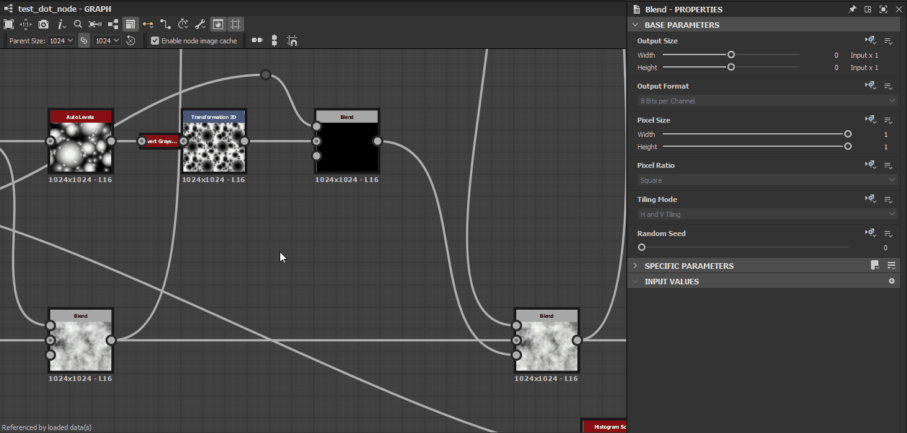
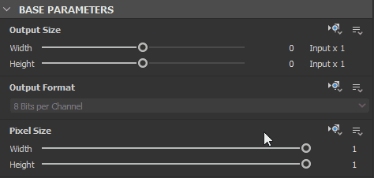
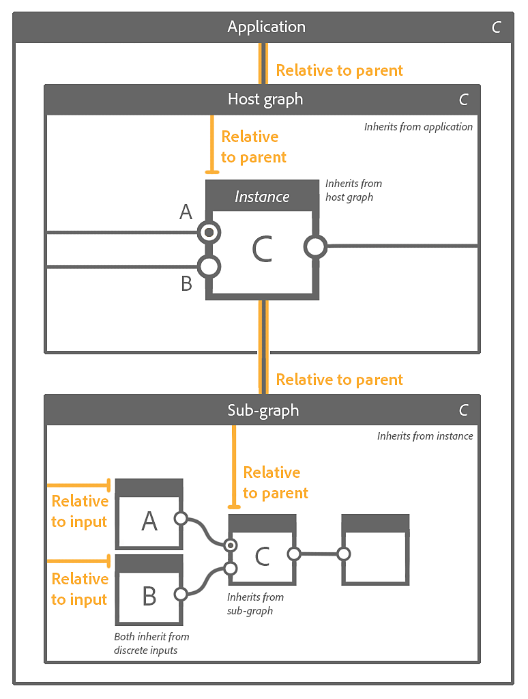
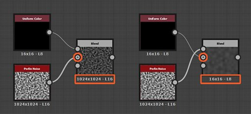

# Inheritance in Substance graphs

This page describes how inheritance is applied in [Substance graphs](../../compositing-graphs/substance-compositing-graphs.md) within [Substance 3D Designer](https://www.adobe.com/products/substance3d-designer.html), and the impact it has on the graph's output.

{width="1400px"}

## Overview

All nodes in a Substance graph can *inherit* the value of some parameters from a source. Inheritance means that changing the value in the source will *carry out that change* across all nodes which inherit from it. This is one of the fundamental concepts underpinning Substance 3D Designer’s power in generating parametric assets.

>[!NOTE]
>
> An annotated project file demonstrating inheritance is available in the [Sample Substance graphs](../../compositing-graphs/sample-compositing-graphs/sample-substance-compositing-graphs.md) section of this documentation.

### Inheritance methods

<table>
<tr style="border: 0;">
<td style="border: 0;" valign="top">

{width="128px"}

<b>Absolute</b>

No inheritance, the value is defined *arbitrarily and locally* for the parameter

</td>
<td style="border: 0;" valign="top">

{width="128px"}

<b>Relative to input</b>

The value is inherited from the data connected to the *Primary input* of the node

</td>
<td style="border: 0;" valign="top">

{width="128px"}

<b>Relative to parent</b>

The value is inherited from the *parent* of the node or graph

</td>
</tr>
</table>

Inheritance methods are applied for a node’s [Base parameters](../../compositing-graphs/graph-parameters/graph-parameters.md), which is the set of common parameters all nodes have which control *fundamental aspects* of their behaviour. These parameters include:

* **Output Size**
* **Output Format** (i.e., bitdepth)
* **Pixel Size**
* **Pixel Ratio**
* **Tiling Mode**
* **Random Seed**

This should let you appreciate how changes in *one* node may impact the resolution, precision, and tiling behaviour of *all nodes downstream* from it.

>[!WARNING]
>
> An important reminder for understanding the concepts discussed in this page: an *instance node* is a [node representing a graph in another graph](../../compositing-graphs/creating-compositing-gra/graph-instances-sub-gra/graph-instances-sub-graphs.md), with its *own discrete parameter values*, hence the term *instance*.  
> E.g., two [Perlin noise](../../compositing-graphs/nodes-reference-for-com/node-library/texture-generators/noises/perlin-noise/perlin-noise.md) nodes in a same graph are both representations of a *same* source graph (`perlin_noise` in `noise_perlin_noise.sbs`) with their *own sets* of parameter values.

>[!NOTE]
>
> **Output size:** Use the  lock button to have the Height value *match* the Width value  
> **Random seed:** Use the  button to assign a new random value to the random seed.

## Making changes

### Changing inheritance methods

In the [Properties](https://helpx.adobe.com/substance-3d/unlisted/documentation/sddoc/parameters-ui-129368153.html) panel, all parameters listed in the [Base parameters](../../compositing-graphs/graph-parameters/graph-parameters.md) section of a node’s properties have a (icon) <b>Set inheritance method</b> dropdown button opposite to their label.  
This button lets you select the inheritance method which should be used to for a parameter.

{width="512px"}

In most cases, a *node*’s Base parameters are set to *Relative to input*, to leverage the procedural behaviour of chaining nodes together, while a *graph*’s Base parameters are set to *Relative to parent*, so the global parameters can adapt to the context the graph is used in.

### TWEAKING INHERITED VALUES

Some Base parameters, such as [Output Size](../../compositing-graphs/output-size/output-size.md), Pixel Size or Random Seed, can be changed *relatively to the inherited value*.

For instance, when the Output Size parameter uses a *Relative to...* inheritance method, a value or `(1, -1)` means one power of two resolution *above* the inherited value for X and one power of two resolution *below* the inherited value for Y such as:

* Inherited value : `(9, 9)` which is `2^9, 2^9 = 512, 512`
* Relative value: `(1, -1)` which is `2^(9+1), 2^(9-1) = 256, 1024`

>[!NOTE]
>
> The [Output Size](../../compositing-graphs/output-size/output-size.md) page digs deeper into this critical Base parameter, and is recommeded reading to understand how the final resolution of a node is computed.

If a function is applied to a Base parameter, the result of the function will also be interpreted using the parameter's inheritance method.  
Keeping the Output Size example in mind, a function aiming at increasing the inherited resolution twofold in X and Y should output the `(2, 2)` Integer2 value.

## Parenthood for nodes and graphs

When using the Relative to parent inheritance method, you should understand what exactly that parent is in a specific context.

The parent of a node is the *graph* it exists in.

The parent of a graph is the *context* it exists in:

* If that graph is a sub-graph instantiated into another host graph as an *instance node*, then the parent of the sub-graph is the *instance node*. The parent of that instance node is the *host graph*.
* If that graph is a root graph, then the parent is the *application itself* and whatever value the application has set for a given parameter. For instance, graphs will inherit from the <b>Parent Size</b> parameter set in the [Graph view’s toolbar](../../interface/the-graph-view/the-graph-view.md).

>[!WARNING]
>
> Parenthood is *applied as-is* when publishing a package to Substance 3D asset files (SBSAR). This means setting any parameter to the *Absolute* inheritance method will *lock* that parameter to its current value in the published asset.  
> While this is desirable for [Bitmap](../../compositing-graphs/nodes-reference-for-com/atomic-nodes/bitmap/bitmap.md) nodes or [optimisation purposes](../../best-practices/performance-optimization/performance-optimization-guidelines.md), for instance, we *strongly* recommend using *Relative to…* inheritance methods when working in Substance graphs unless there is a *clear, deliberate purpose* in doing otherwise.

### IN-CONTEXT EDITING

When using [In-context editing](../../compositing-graphs/creating-compositing-gra/graph-instances-sub-gra/graph-instances-sub-graphs.md) on a graph instance node, the parent of the graph is the *instance node*. In that case, the <b>Parent Size</b> setting in the [Graph view’s toolbar](../../interface/the-graph-view/the-graph-view.md) is *disabled*, as the graph inherits is base parameters from the instance node.

This trait is the *point* of in-context editing and should be *factored in* when setting inheritance method and assessing the current values of any node’s Base parameters.

## Inheritance with multiple inputs

When a graph has multiple inputs, each input may inherit from its discrete input data or from the graph, depending on its inheritance method:

<table>
<tr style="border: 0;">
<td style="border: 0;" valign="top">

{width="128px"}

<b>Relative to input</b>

The input inherits from its discrete input data, regardless of the graph’s Base parameters. This is very helpful for controlling data per input.

</td>
<td style="border: 0;" valign="top">

{width="128px"}

<b>Relative to parent</b>

The input inherits from the graph, and the data it receives is adapted accordingly.

</td>
<td style="border: 0;" valign="top">

</td>
</tr>
</table>

### Primary input

<table>
<tr style="border: 0;">
<td style="border: 0;" valign="top">

<table>
<tr style="border: 0;">
<td style="border: 0;" valign="top">

{width="48px"}

</td>
<td style="border: 0;" valign="top">

{width="48px"}

</td>
<td style="border: 0;" valign="top">

{width="48px"}

</td>
</tr>
</table>

One of the inputs may be set as the graph’s **Primary input**, by clicking **RMB** on that [Input](../../compositing-graphs/nodes-reference-for-com/atomic-nodes/input/input.md) node and selecting the **Set as Primary Input** option in the contextual menu.

</td>
<td style="border: 0;" valign="top">

</td>
</tr>
</table>

When the graph is instanced into another graph as an instance node, all the instance node’s Base parameters which are set to *Relative to input* will inherit the data connected to *that input*. The Primary input of an instance node may be identified by the small dark dot in its connector.

The other inputs which are set to *Relative to parent* will inherit the same Base parameters’ values, as they inherit from the *graph* which inherits from the *instance node\**, which inherits from the Primary input.

\*: This is true is the graph uses the *Relative to parent* inheritance method.

## Examples

Here are some examples covering different cases of inheritance, and the interplay of the inheritance methods set in the following actors, from top to bottom:

1. Application
1. Host graph
1. Instance node in host graph
1. Sub-graph – i.e., the graph referenced by the instance node
1. Nodes in sub-graph

The *inheritance method* set for an actor is displayed in orange just above it. The *flow of inheritance* to its source is displayed with orange lines.

Letters represent *separate sets* of Base parameters, and should help follow what data is inherited by which actor.

<table>
<tr style="border: 0;">
<td style="border: 0;" valign="top">

**Example A**

{zoomable="yes"}

</td>
<td style="border: 0;" valign="top">

**Example B**

{zoomable="yes"}

</td>
</tr>
</table>

<table>
<tr style="border: 0;">
<td style="border: 0;" valign="top">

**Example C**

{zoomable="yes"}

</td>
<td style="border: 0;" valign="top">

**Example D**

{zoomable="yes"}

</td>
</tr>
</table>

## Troubleshooting inheritance issues

As you build your graph and increase its complexity, you may run into unexpected results caused by inheritance. If the output of a node has an incorrect resolution or precision (i.e., bitdepth), you should go *up the inheritance chain* to pinpoint where these values come from.

A good starting point is checking the data displayed just below a node: these are the resolution, color format and precision of the image output by the *first output* of the node. While understanding the resolution is straightforward, the second piece of data is worth detailing:

* The *letter prefix* refer to the image’s color format:
  * <b>L</b>: Luminance (i.e., grayscale)
  * <b>C</b>: Color
* The *number* refer to the image’s bitdepth, from lowest to highest precision:
  * <b>8</b>: 8-bit integer (256 steps in 0-1)
  * <b>16</b>: 16-bit integer (65 536 steps in 0-1)
  * <b>16F</b>: 16-bit floating point (low precision values beyond 0-1, including negatives)
  * <b>32F</b>: 32-bit floating point (high precision values beyond 0-1, including negatives)

If the node has more than one output, you can check their resolution and precision in two easy ways:

* Double-click <b>LMB</b> on the *output connector* to display the image in the [2D view](../../interface/2d-view/2d-view.md), and check the image information displayed on the *bottom left corner* of the 2D view’s viewport
* Create a [Levels](../../compositing-graphs/nodes-reference-for-com/atomic-nodes/levels/levels.md) or [Transformation 2D](../../compositing-graphs/nodes-reference-for-com/atomic-nodes/transformation-2d/transformation-2d.md) node and connect its input to the output you want to check. The node will *inherit from the output* by default, and you can then check the values below the node.

Now you can go up the node chain in the graph and try to find the *first node* where the unexpected values appear. Check the inheritance method of its Base parameters.

If nothing is amiss and the node is an instance node, you need to go deeper and open the graph referenced by that instance node. Repeat the process starting from the graph’s Output nodes and going upstream.

### A COMMON EXAMPLE

In particular, the *Primary input* concept is easily *overlooked* and can result in inheritance issues.

The [Blend](../../compositing-graphs/nodes-reference-for-com/atomic-nodes/blend/blend.md) node is very susceptible to this, as it is used very frequently. Its <b>Background</b> input is its Primary input.

{width="512px"}

You need to pay attention to the order in which you blend the two inputs: the input which resolution and precision you wish to retain down the graph should be connected to the Background input, if the blending mode you need makes it possible. If not, then you may need to tweak the Blend node’s Base parameters and their inheritance method to compensate.
