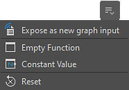

# Manage parameters

When you need to control parameters in any way other than adjusting them directly, Designer offers several useful actions to:

* the values of all the parameters of a node
* Save the values or all the parameters of a node to a [preset file](../../compositing-graphs/manage-parameters/parameter-presets/parameter-presets.md), to be reused later
* [Expose the parameters](../../compositing-graphs/manage-parameters/exposing-a-parameter/exposing-a-parameter.md) of nodes to make them accessible and link them together
* [Hide or show parameters](../../compositing-graphs/visible-control-vis/visible-if-control-visibility-of-inputs-outputs-and-parameters.md) according to the values of other parameters
* Use a [Substance function graph](../../function-graphs/function-graphs.md) to compute the value of a parameter

## Parameter actions

The tools available for managing parameters are available in the following locations:

### Global actions

<table>
<tr style="border: 0;">
<td width="100.00%" style="border: 0;" valign="top">

When the properties of a node are displayed in the Properties dock, the node parameters can be managed globally using the '<b>Manage parameters</b>' menu in the following section header:

* For [atomic nodes](../../compositing-graphs/nodes-reference-for-com/atomic-nodes/atomic-nodes.md): Specific parameters
* For [instance nodes](../../compositing-graphs/creating-compositing-gra/graph-instances-sub-gra/graph-instances-sub-graphs.md): Instance parameters

</td>
<td width="33.33%" style="border: 0;" valign="top">

{zoomable="yes"}

</td>
</tr>
</table>

Actions in this menu will impact *all* the parameters listed in that section:

* <b>Expose parameters:</b> Opens the 'Batch expose parameters' dialog. For every exposed parameter, the action creates a new graph input and automatically sets a function using that graph input. Learn more about exposing parameters in [this dedicated page](../../compositing-graphs/manage-parameters/exposing-a-parameter/exposing-a-parameter.md).
* <b>Copy parameters:</b> See section below.
* <b>Paste parameters:</b> See [Copy and paste parameters](../../compositing-graphs/manage-parameters/manage-parameters.md) section below.
* <b>Save parameters as a preset file:</b> Learn more about parameter presets in [this dedicated page](../../compositing-graphs/manage-parameters/parameter-presets/parameter-presets.md).
* <b>Apply parameters from a preset file:</b> Learn more about parameter presets in [this dedicated page](../../compositing-graphs/manage-parameters/parameter-presets/parameter-presets.md).
* <b>Reset all:</b> Resets all parameters to their default values and ranges. If a functions were applied to any parameters, they are dismissed.

>[!NOTE]
>
> Some actions are not available for some atomic nodes. See below.

### Single parameter actions

<table>
<tr style="border: 0;">
<td width="100.00%" style="border: 0;" valign="top">

If you want to manage a *single* parameter, use the '<b>Manage function</b>' menu opposite to the parameter label.

</td>
<td width="33.33%" style="border: 0;" valign="top">

{zoomable="yes"}

</td>
</tr>
</table>

You can apply a [Substance function graph](../../function-graphs/the-function-graph/the-function-graph.md) to that parameter in three ways:

* <b>Expose as new graph input:</b> Which creates a new graph input and automatically sets a function using that graph input. Learn more about exposing parameters in [this dedicated page](../../compositing-graphs/manage-parameters/exposing-a-parameter/exposing-a-parameter.md).
* <b>Empty function:</b> Author a function from scratch.
* <b>Constant value:</b> Edit a function starting from a [constant value node](../../function-graphs/nodes-reference-for-fun/atomic-function-nodes/constant-nodes/constant-nodes.md) set to the parameter's current value.
* <b>Reset:</b> Resets the parameter to its default value and range. If a function was applied to the parameter, it is dismissed.

>[!NOTE]
>
> The copy/paste and preset file actions are global to all parameters and are thus not available for single parameters.

### Node contextual menu

<table>
<tr style="border: 0;">
<td width="100.00%" style="border: 0;" valign="top">

Some parameter actions from the *global* menu listed above are available in the node contextual menu. Click RMB on a node and go to 'Manage parameters' to access them.

Note that the copy/paste actions are not available in this menu. You may find them in the node properties as explained above.

The same for atomic nodes apply to this menu.

</td>
<td width="50.00%" style="border: 0;" valign="top">

{zoomable="yes"}

</td>
</tr>
</table>

<table>
<tr style="border: 0;">
<td style="border: 0;" valign="top">

## Copy and paste parameters

It is possible to copy all parameters values for a source node, and paste them onto a target node. The parameters of the source and target nodes are <b>matched based on both their identifiers and types</b>.

For example, a parameter 'Scale' which identifier is 'scale' and type is 'Float' can be copied and pasted onto another parameter 'Shape Scale' when its identifier is also  'scale' and its type is also 'Float'.

This feature works in the same way as using a [parameter preset file](../../compositing-graphs/manage-parameters/parameter-presets/parameter-presets.md). Indeed, the data copied to the clipboard is the same as the data stored in SBSPRS preset files, and can be pasted into any text editor to be reviewed and edited.

</td>
<td style="border: 0;" valign="top">

{zoomable="yes"}

</td>
</tr>
</table>

## Atomic nodes limitations

Some features are not available for some [atomic nodes](../../compositing-graphs/nodes-reference-for-com/atomic-nodes/atomic-nodes.md), because of their specific implementation and controls.

These actions...

* [Save/Apply preset file](../../compositing-graphs/manage-parameters/parameter-presets/parameter-presets.md)

...are not available for these atomic nodes:

<table>
<tr style="border: 0;">
<td style="border: 0;" valign="top">

[Bitmap](../../compositing-graphs/nodes-reference-for-com/atomic-nodes/bitmap/bitmap.md)

[Curve](../../compositing-graphs/nodes-reference-for-com/atomic-nodes/curve/curve.md)

[Distance](../../compositing-graphs/nodes-reference-for-com/atomic-nodes/distance/distance.md)

[FX-Map](../../compositing-graphs/nodes-reference-for-com/atomic-nodes/fx-map/fx-map.md)

[Gradient (Dynamic)](../../compositing-graphs/nodes-reference-for-com/atomic-nodes/gradient-dynamic/gradient-dynamic.md)

</td>
<td style="border: 0;" valign="top">

[Gradient map](../../compositing-graphs/nodes-reference-for-com/atomic-nodes/gradient-map/gradient-map.md)

[Input color](../../compositing-graphs/nodes-reference-for-com/atomic-nodes/input/input.md)

[Input grayscale](../../compositing-graphs/nodes-reference-for-com/atomic-nodes/input/input.md)

[Input value](../../compositing-graphs/nodes-reference-for-com/atomic-nodes/input/input.md)

[Output](../../compositing-graphs/nodes-reference-for-com/atomic-nodes/output/output.md)

</td>
<td style="border: 0;" valign="top">

[Pixel processor](../../compositing-graphs/nodes-reference-for-com/atomic-nodes/pixel-processor/pixel-processor.md)

[SVG](../../compositing-graphs/nodes-reference-for-com/atomic-nodes/svg/svg.md)

[Text](../../compositing-graphs/nodes-reference-for-com/atomic-nodes/text/text.md)

[Uniform color](../../compositing-graphs/nodes-reference-for-com/atomic-nodes/uniform-color/uniform-color.md)

[Value processor](../../compositing-graphs/nodes-reference-for-com/atomic-nodes/value-processor/value-processor.md)

</td>
<td style="border: 0;" valign="top">

</td>
</tr>
</table>
