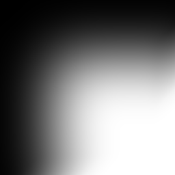

# Blur

<table>
<tr style="border: 0;">
<td width="41.60%" style="border: 0;" valign="top">

{width="200px"}

**In:** Atomic Nodes

**Simple**

</td>
<td width="58.30%" style="border: 0;" valign="top">

## Description

The Blur Node performs a "box-blur" operation: averaging the values of pixels over a set distance, resulting in a fuzzy, unsharp look. It provides the simplest, fastest and most basic blurring operation available in [Substance 3D Designer](https://www.adobe.com/products/substance3d-designer.html).

While blur works well for fast, simple operations, such as slightly softening some edges, in any more demanding scenario [Blur HQ](../../../../compositing-graphs/nodes-reference-for-com/node-library/filters/blurs/blur-hq/blur-hq.md) is a better choice, trading off performance for quality.

</td>
</tr>
</table>

## Parameters

* **Intensity**: 0-unlimited  
  Sets the intensity or distance for the blur. The number is not capped, but at high values the entire image turns to a averaged color.

Below Example shows this node's Blur on the left, versus [Blur HQ](../../../../compositing-graphs/nodes-reference-for-com/node-library/filters/blurs/blur-hq/blur-hq.md) on the right, when using high values (50 in this case). At values of around 1-2 the difference is not noticeable.

| Blur (Atomic) | Blur HQ |
| --- | --- |
| 

 | 

 |
