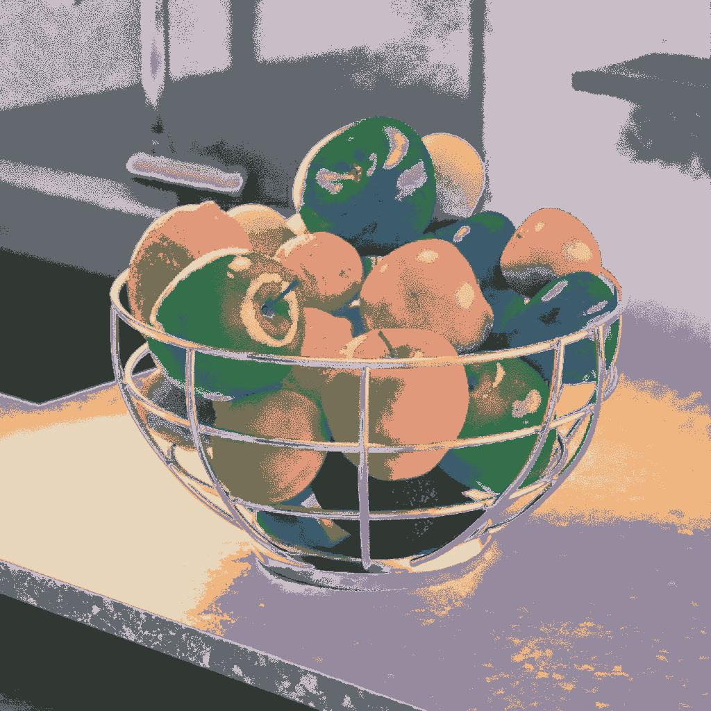
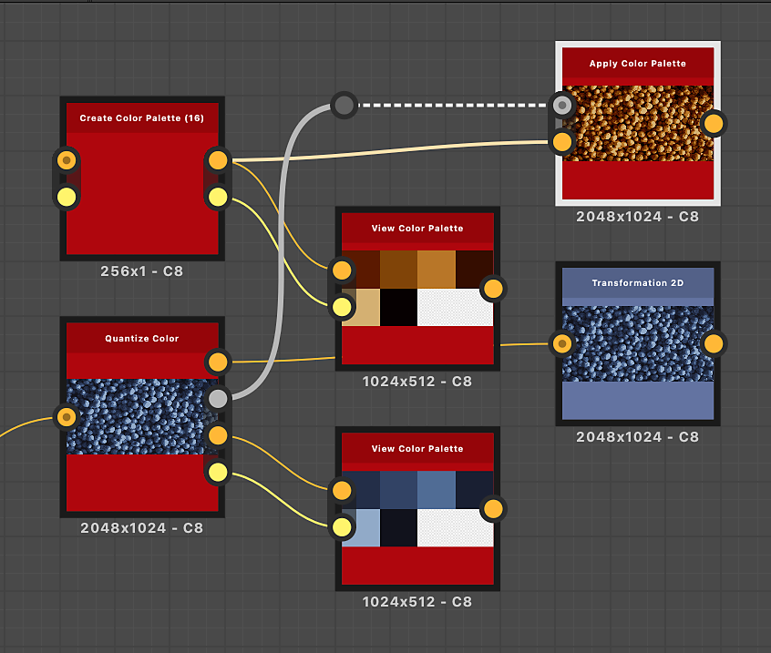

# Apply Color Palette

<table>
<tr style="border: 0;">
<td width="33.33%" style="border: 0;" valign="top">

{width="200px"}

<b>In:</b> Filters &gt; Adjustments

</td>
<td width="100.00%" style="border: 0;" valign="top">

## Description

Applies the colors in an ordered palette to an image, using an ID map.

Colors are distributed by matching the indexes in the ID map to the indexes of colors in the palette.

For instance, color #2 in the palette will be applied to all pixels in the ID map with an ID value of 2.

This node may be used in combination with the following nodes: [Quantize Color](../../../../../../compositing-graphs/nodes-reference-for-com/node-library/filters/adjustments/quantize-color/quantize-color.md), [Create Color Palette](../../../../../../compositing-graphs/nodes-reference-for-com/node-library/filters/adjustments/create-color-palette-16/create-color-palette-16.md), [Modify Color Palette](../../../../../../compositing-graphs/nodes-reference-for-com/node-library/filters/adjustments/modify-color-palette/modify-color-palette.md), [View Color Palette](../../../../../../compositing-graphs/nodes-reference-for-com/node-library/filters/adjustments/view-color-palette/view-color-palette.md).

</td>
</tr>
</table>

<table>
<tr style="border: 0;">
<td style="border: 0;" valign="top">

</td>
<td style="border: 0;" valign="top">

</td>
<td style="border: 0;" valign="top">

</td>
</tr>
</table>

## Input connectors

|  |  |
| --- | --- |
| <b>ID</b> *Grayscale* PRIMARY | The input ID map used to distribute the colors in the input palette.   An ID map is an image where pixels which are part of a whole (E.g., a shape) all hold the same unique identification value. In this case, the value is an integer.   An ID map can be produced using a [Quantize Color](../../../../../../compositing-graphs/nodes-reference-for-com/node-library/filters/adjustments/quantize-color/quantize-color.md) node. |
| <b>Palette</b> *Color* | An ordered list of RGB colors encoded as a row of pixels. The palette can hold a maximum of 256 colors. This is the palette that the node maps to the indexes of the ID map.   Palettes may be produced with a [Quantize Color](../../../../../../compositing-graphs/nodes-reference-for-com/node-library/filters/adjustments/quantize-color/quantize-color.md) node and modified with a [Modify Color Palette](../../../../../../compositing-graphs/nodes-reference-for-com/node-library/filters/adjustments/modify-color-palette/modify-color-palette.md) node. |

## Output connectors

|  |  |
| --- | --- |
| <b>Output</b> *Color* | The result of mapping the colors in the palette to the indexes of the ID map. |

## Examples

{zoomable="yes"}

<table>
  <tr>
    <td>
      
       <i>Before</i>
    </td>
    <td>
      
       <i>After</i>
    </td>
  </tr>
</table>

{zoomable="yes"}

<table>
  <tr>
    <td>
      
       <i>Before</i>
    </td>
    <td>
      
       <i>After</i>
    </td>
  </tr>
</table>
