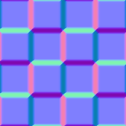

# Normal Blend

<table>
<tr style="border: 0;">
<td style="border: 0;" valign="top">

{width="128px"}

## Normal Blend

**In:** *Filters/Normal Map*

**Intermediate**

</td>
<td style="border: 0;" valign="top">

## Description

Normal Blend allows you to blend two Normalmaps together with an optional mask, while making sure all values stay normalised. It doesn't differ much from an [atomic Blend Node](../../../../../../compositing-graphs/nodes-reference-for-com/atomic-nodes/blend/blend.md), but has added internal calculations for Normalmaps.

Normal Blend is not intended for combining (overlaying) Normalmaps, where the top map adds detail to the bottom map. For that, use [Normal Combine](../../../../../../compositing-graphs/nodes-reference-for-com/node-library/filters/normal-map/normal-combine/normal-combine.md) instead.

## Parameters

### Inputs

* **NormalFG**: *Color Input*   
  Foreground/Top Normalmap.
* **NormalBG**: *Color Input*   
  Background/Bottom Normalmap.
* **Mask**: *Grayscale Input*   
  Mask slot used for masking the node's effects. Can be toggled with the "Use Mask" parameter.

### Parameters

* **Opacity**: *0.0 - 1.0*  
  Blending Opacity between Foreground and Background
* **Use Mask**: *False/True*  
  Toggles the use of the Mask map on or off.

## Example Images

*(.gif format introduces dithering in example, in-application results are smooth)*

</td>
</tr>
</table>
