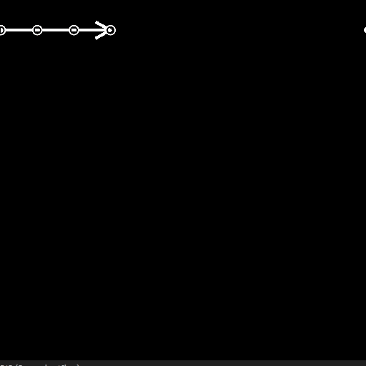

# Point List

<table>
<tr style="border: 0;">
<td width="33.33%" style="border: 0;" valign="top">

<b>In:</b> Spline &amp; Path Tools &gt; Spline Tools

</td>
<td width="100.00%" style="border: 0;" valign="top">

## Description

Generates a list of points to be traversed by a spline.

If an existing point list is supplied to the <b>Point</b> inputs, the generated list is appended to the input list.

</td>
</tr>
</table>

>[!TIP]
>
> This node can be used to supply points to the [Spline (Poly Quadratic)](../../../../../../compositing-graphs/nodes-reference-for-com/node-library/spline-paths-tools/spline-tools/spline-poly-quadratic/spline-poly-quadratic.md) node in order to build splines.

>[!IMPORTANT]
>
> The <b>Point List</b> and <b>Point Number</b> connectors are *not compatible* with <b>Spline Coord</b>, <b>Spline Data</b> and <b>Spline Amount</b> connectors, for they rely on different data.

## Input connectors

<b>Preview</b>*Grayscale*The preview of the points as a grayscale image.

<b>Point List Input</b> *Color*  
A list of input points encoded in the RGBA channels of a color image:  
    <b>R</b> - X position  
    <b>G</b> - Y position  
    <b>B</b> - Height  
    <b>A</b> - Packed data:  
            * Integer part: Smoothness;  
            * Fractional part: Thickness.

<b>Point Number Input</b> *Integer*  
The number of input points.

## Output connectors

<b>Preview</b>*Grayscale*The preview of the points as a grayscale image.

<b>Point List </b>*Color*  
The output list of points encoded in the RGBA channels of a color image:  
    <b>R</b> - X position  
    <b>G</b> - Y position  
    <b>B</b> - Height  
    <b>A</b> - Packed data:  
            * Integer part: Smoothness;  
            * Fractional part: Thickness.

<b>Point Number </b>*Integer*  
The output number of points.

## Parameters

<b>Point Number</b> *Integer*The number of generated points.

<b>Global Smoothness Adjustment</b> *Float*Applies a uniform offset to the smoothness value of all points.  
The resulting smoothness value is clamped to the &#91;0;1&#93; range.

+++Points Properties

p# PropertiesFloat3Sets the properties of the p# point.- Height:Adjusts the height of the point where a lower value means a lower or deeper location;- Smoothness:Offsets the start of the smoothing of the spline at p#, where a value of 0 results in a hard trajectory and 1 in an entirely smooth one;- Thickness:Adjusts the thickness of the spline at p#. Thickness is used by specific Spline nodes.

+++

+++Points Coordinates

p#Float2Sets the position of the p# point in texture space.

+++

+++Preview

Show LabelsBooleanFor each point, displays the point's name next to it in the 'Preview' output.

Label SizeFloat(Available when 'Show Labels' is set to 'True')The size of the label for each point in texture space, where 0.1 is a tenth of the texture's width.

Show PointsBooleanDisplays the points in the 'Preview' output.

Points SizeFloat(Available when 'Show Points' is set to 'True')The radius of the points in texture space, where 0.1 is a tenth of the texture's width.

+++

## Examples

<table>
<tr style="border: 0;">
<td style="border: 0;" valign="top">

</td>
<td style="border: 0;" valign="top">

</td>
</tr>
</table>
