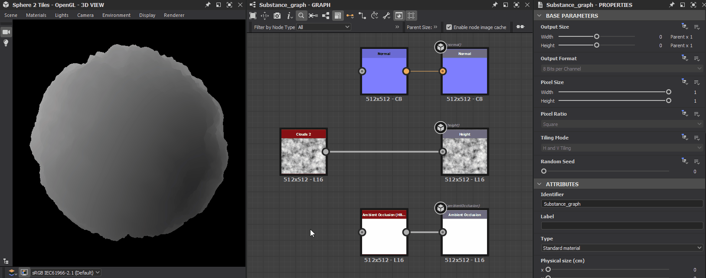

# 3D View issues

This page lists technical issues related to the [3D view](../../interface/3d-view/3d-view.md) in Substance 3D Designer, and offer troubleshooting steps for each.

## Low performance: Discrete GPU is not used

<b>!&#91;(error)&#93;(../../assets/error.svg) Issue</b>

Substance 3D Designer does not use the system's *discrete* GPU (<b>dGPU</b>), and uses the *integrated* GPU (<b>iGPU</b>) instead. This results in low performance when rendering graphs and/or the [3D view](../../interface/3d-view/3d-view.md).

<b>!&#91;(tick)&#93;(../../assets/check.svg) Recommended steps</b>

Systems with switchable graphics can *force the dGPU* which should be used for a *specific application* in dedicated software, depending on the GPU manufacturer.

For instance, users with an <b>Nvidia dGPU</b> can do the following:

1. Close Substance 3D Designer
1. Open the <b>NVIDIA Control Panel</b>
1. Go to <b>Manage 3D settings</b> screen in the <b>3D settings</b> section
1. Look for the 'Substance 3D Designer' entry in the <b>Program Settings</b> tab
1. Select <b>High-performance NVIDIA processor</b> in the <b>Preferred GPU</b> combobox
1. Start Substance 3D Designer

>[!WARNING]
>
> Please note integrated GPUs (iGPU) are *not supported*. You can learn more on the [System requirements](../../getting-started/system-requirements/system-requirements.md) page.

## 3D object is flat

** Issue**

A 3D object which featured detailed volumes in one session becomes flat in the next session, however the graph has not changed and the Height map carries the same data.

** Recommended steps**

The deformation effect of a 3D object according to a Height map is performed using a technique called **Tessellation displacement**. This technique involves two steps:

1. **Tessellation**: the object geometry is *subdivided* into vertices, resulting in a *denser geometry* to support finer volume detail
1. **Displacement**: the vertices are *moved* - i.e. displaced - along their *normal vector*. The normal vector follows the direction a polygon is facing and has a magnitude (i.e. length) of 1

The displacement *direction* is known: the direction of the normal vector.  
The displacement *distance* by which the vertices are moved is calculated as follows : `Distance = Height scale * Height map`. Because the Height map has *not changed* in the graph, that leaves the **Height scale**.

The default Height scale value is **1.0**, which may result in a displacement effect which is *not noticeable* depending on the mesh displayed in the 3D View and the Height map applied to it.

>[!WARNING]
>
> If not set explicitly in the graph, the Height scale value is *reset to default* each time a new 3D view render is started, e.g. when loading a graph after starting Designer or switching to a different graph.

This value can be modified in the following ways:

### In the 3D view

Open the <b>Materials</b> menu open the submenu of the current material (*Default* in most cases) and select the <b>Edit</b> option. In the <b>Properties</b> panel, find the <b>Scale</b> parameter in the <b>Height</b> category.

>[!NOTE]
>
> Using this method, you can then use the **Save current scene state as default** option in the **Scene** menu of the 3D view to use your custom Height scale value as the *new default* for *all* future 3D View scenes.


### In the Graph view

Create an [Output](../../compositing-graphs/nodes-reference-for-com/atomic-nodes/output/output.md) node and set the "<b>heightscale</b>" usage in its properties, then *reapply the graph* in the 3D View. You may feed this output a texture, or a value using a [Value processor](../../compositing-graphs/nodes-reference-for-com/atomic-nodes/value-processor/value-processor.md) node.

>[!NOTE]
>
> Using this method, you can set a custom Height scale value *per graph*, which lets you adjust it to match the specific material of that graph.


## 3D view is entirely black

<b>!&#91;(error)&#93;(../../assets/error.svg) Issue</b>

In versions 15.0.0 and higher, the viewport of the 3D view is flat black. I see some text overlays (E.g., samples and render time) but the 3D scene is not visible.

<b>!&#91;(tick)&#93;(../../assets/check.svg) Recommended steps</b>

Version 15.1 and higher

The new 3D renderers were upgraded in version 15.1 and require recent GPU drivers. Please update your system's GPU drivers to the latest version.

You may find drivers here:   [NVIDIA](https://www.nvidia.com/Download/index.aspx?lang=en-us)   [AMD](https://www.amd.com/en/support)   [Intel](https://downloadcenter.intel.com/product/80939/Graphics-Drivers)

Version 15.0 and higher

Designer [15.0.0](../../release-notes/version-15-0/version-15-0.md) introduced our new in-house [3D renderers](../../interface/3d-view/3d-renderers/3d-renderers.md), which use modern technologies and therefore are not supported by older GPUs.

Supported GPUs include NVIDIA RTX 20 series (Turing) or higher, as per Designer's [system requirements](../../getting-started/system-requirements/system-requirements.md).

You may continue using the OpenGL renderer by default, by using the [new option in the Project settings](../../interface/preferences-window/project-settings/project-settings.md):

1. Go to Edit &gt; Preferences &gt; Projects
1. Select the last project file in the list
1. Under the list of project files, select the 3D View tab
1. Set the 'Default renderer' option to 'OpenGL (deprecated)'
1. Click 'OK' to validate the changes

Now, all new 3D View will use the OpenGL renderer by default, which will let you continue working as before.

>[!NOTE]
>
> The same issue and troubleshooting steps apply to most AMD and Intel GPUs, which are currently *not supported* by our new 3D renderers.

>[!IMPORTANT]
>
> The OpenGL renderer is *deprecated* and may be removed from Designer in the future. We recommend upgrading the system's GPU for preventing disruptions in your workflow and ensuring continued support.

## 'Renderer not supported' message is displayed

<b>!&#91;(error)&#93;(../../assets/error.svg) Issue</b>

In versions 15.0.0 and higher, the 'Renderer not supported' message appears in the lower right corner of the viewport when using the new 3D renderers (Rasterizer, GPU pathtracer). The 3D scene is not visible.

<b>!&#91;(tick)&#93;(../../assets/check.svg) Recommended steps</b>

Designer [15.0.0](../../release-notes/version-15-0/version-15-0.md) introduced our new in-house [3D renderers](../../interface/3d-view/3d-renderers/3d-renderers.md), which use modern technologies and therefore are not supported by older GPUs.

Supported GPUs include NVIDIA RTX 20 series (Turing) or higher, as per Designer's [system requirements](../../getting-started/system-requirements/system-requirements.md).

On default settings, the 3D View will automatically fall back to the OpenGL renderer, if the 'Default renderer' option is set to 'Default (predefined renderer)' in the [Project settings](../../interface/preferences-window/project-settings/project-settings.md).

You may find and adjust that option by following these steps:

1. Go to Edit &gt; Preferences &gt; Projects
1. Select the last project file in the list
1. Under the list of project files, select the 3D View tab
1. The 'Default renderer' option is listed in the settings within the tab

>[!NOTE]
>
> Only GPUs in the <b>NVIDIA GTX series</b> can currently be detected as not supported.
> 
> However, most AMD and Intel GPUs are also not supported and will produce a black render with no message. Refer to the '3D View is entirely black' item above for guidance with those GPUs.

>[!IMPORTANT]
>
> The OpenGL renderer is *deprecated* and may be removed from Designer in the future. We recommend upgrading the system's GPU for preventing disruptions in your workflow and ensuring continued support.

## 3D object looks entirely smooth

** Issue**

After working on the data sent to the **Height** [output](../../compositing-graphs/nodes-reference-for-com/atomic-nodes/output/output.md), the object appears to have some volume but *looks entirely smooth*, as if the height information was ignored in the shading.

<table>
<tr style="border: 0;">
<td width="58.30%" style="border: 0;" valign="top">

** Recommended steps**

Make sure the height data is *converted to normals* which are connected to the **Normal** [output](../../compositing-graphs/nodes-reference-for-com/atomic-nodes/output/output.md).

When using the **Tessellation Displacement** technique – see "3D object is flat" above – the objects may *deform* to follow the height data but its surface will *not react to light differently* until its *normals* are also modified to account for the height data.

The solution is quite simple: connect the last node of the stream leading to the Height output to a [Normal](../../compositing-graphs/nodes-reference-for-com/atomic-nodes/normal/normal.md) node. Adjust that node's **Intensity** parameter according to the material you are working on and connect the Normal node to the **Normal** output.

</td>
<td width="41.60%" style="border: 0;" valign="top">

{width="256px"}

</td>
</tr>
</table>

## Render is blurry/pixelated

** Issue**

The rendered image looks blurry or pixelated when the system uses *display scaling*.

<table>
<tr style="border: 0;">
<td width="58.30%" style="border: 0;" valign="top">

** Recommended steps**

By default, Designer uses the *scaled* display resolution to define the [3D view](../../interface/3d-view/3d-view.md)'s rendering resolution. You can change this so the *native* display resolution is used instead for a crisp render.

Open the **Edit** menu and select the **Preferences...** option. In the [Preferences](../../interface/preferences-window/preferences-window.md) window, open the **3D View** section and set the **Viewport scaling** parameter to *None*.

</td>
<td width="41.60%" style="border: 0;" valign="top">

{width="256px"}

</td>
</tr>
</table>

## I cannot find the 'Tessellation factor' property

<b>!&#91;(error)&#93;(../../assets/error.svg) Issue</b>

After upgrading Designer to version 15.0.0, I cannot find the 'Tessellation factor' parameter in the material properties where it used to be.

<b>!&#91;(tick)&#93;(../../assets/check.svg) Recommended steps</b>

When using the new renderers (Rasterizer and GPU Pathtracer), the 'Tessellation factor' is found in the properties of these renderers. In the 3D View, go to <b>Renderer &gt; Edit settings</b>. The property will be listed in the Properties dock.

>[!NOTE]
>
> The scope of tessellation varies according to the renderer:
> 
> * Rasterizer/GPU Pathtracer: a unique value applied global to the entire scene.
> * OpenGL: one value per material.
> * Iray: one value per mesh.

## 3D objects look wrong: their shading does not suit the lighting

<b>!&#91;(error)&#93;(../../assets/error.svg) Issue</b>

The shading of objects relies on their normal, tangent and binormal vectors. Their coordinates use the &#91;-1, 1&#93; range, whereas normal maps use the &#91;0, 1&#93; range in most cases. To adapt values from one to the other, a <b>bias and scale</b> need to be applied: value\*scale+bias.

For instance, a scale of 2 and a bias of -1 adapts the x value from &#91;0, 1&#93; to &#91;-1, 1&#93; thusly: x\*2-1.

Designer does not apply a normal scale and bias unless they are specified by a 3D mesh. If that information is missing, a warning is raised in the Console when [overriding any of its materials](../../working-with-3d-scenes/overriding-scene-mat/overriding-scene-materials.md):

```

[SceneGraph]No 'scale' or 'bias' defined on the UsdUVTexture shader '/root/material/<materialName>' (the rendering may be incorrect)
```


<b>!&#91;(tick)&#93;(../../assets/check.svg) Recommended steps</b>

For scenes exported to USD formats a while ago: Reexport the scene using a recent version of USD, which will include the necessary data. Pay attention to properties related to normal scale and bias if there are any, which will depend on the software used to export the scene.

When [overriding a material](../../working-with-3d-scenes/overriding-scene-mat/overriding-scene-materials.md), Designer processes the mesh and computes any missing data related ot its normals, tangents and binormals. If Designer's default scale and bias happen to match the ones required for the mesh, then the mesh will look correct when overridden.

## Crash when starting 3D View

<b>!&#91;(error)&#93;(../../assets/error.svg) Issue</b>

Designer crashes at the time of starting the 3D View, when creating a project, loading a project, or manually starting a 3D View.

<b>!&#91;(tick)&#93;(../../assets/check.svg) Recommended steps</b>

First, make sure your system meets Designer's [system requirements](../../getting-started/system-requirements/system-requirements.md).

Then, update your graphics drivers. You can find the latest drivers for your GPU by following these links:

[NVIDIA](https://www.nvidia.com/Download/index.aspx?lang=en-us)  |  [AMD](https://www.amd.com/en/support)  |  [Intel](https://downloadcenter.intel.com/product/80939/Graphics-Drivers)

If your system includes both an integrated GPU (iGPU) and discrete GPU (dGPU), make sure to *update the drivers for both*!

Then, disable any software that may inject or overlay data in a 3D graphics process. Examples include:

* Post-process injectors such as ReShade
* Overlays such as custom crosshairs or GPU performance metrics
* Screen capture software for recording, streaming or sharing 3D graphics in real time
