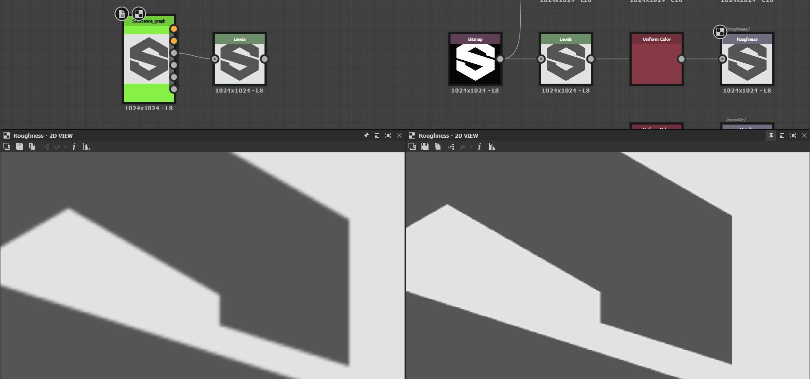

# Incorrect image output

This page lists technical issues in Substance 3D Designer resulting in an image output which is incorrect of unexpected , and offers troubleshooting steps for each.

## Visible stepping/banding

<table>
<tr style="border: 0;">
<td width="58.30%" style="border: 0;" valign="top">

** Issue**

Gradients in the image output are stepped instead of smooth. The stepping is caused by the *value range used by the image being too narrow*.  
This means there are not enough values to smoothly transition from one step of a gradient to the next.

Luminance/RGBA values can be encoded using integer or floating point values, impacting their *precision*:

* **Integer** offers 8-bit precision (0-255, so 256 possible values) and 16-bit precision (0-65535 so 65536 possible values) to store a value in the 0-1 range.
* **Floating point** offers 16-bit (HDR 16F) and 32-bit (HDR 32F) precision, with the ability to store values outside of the 0-1 range including negative values. This lets you work with high dynamic range (HDR) images, where the luminance value may go far above 1.0.

If you do not specifically need to work with HDR images, then most of your nodes will likely output value in the 0-1 range encoded using integers. If the Output format of the image is 8-bit, then the image can only use 256 values which will often result in visible stepping on gradients. This can particularly impact the output of Normal nodes.

</td>
<td width="41.60%" style="border: 0;" valign="top">

{width="256px"}{width="256px"}{width="256px"}

</td>
</tr>
</table>

** Recommended steps**

Check the **Output format** (i.e. bitdepth) of the node and all nodes upstream and make sure these node use *at least 16-bit Integer precision*.

The Output format parameter is often set to the *Relative to input* [inheritance method](../../compositing-graphs/inheritance-compositing/inheritance-in-substance-compositing-graphs.md), which can propagate the low precision throughout the graph. Ideally, by going upstream in the graph you will find the root cause of the issue.

You can quickly identify the precision of a node's output by taking a look at the text information displayed below the node:

* **L/C** refer to the image being Grayscale (i.e. Luminance) or Color
* **8/16** means integer encoding
* **16F/32F** means floating point encoding

For instance:

* L8: grayscale 8-bit integer
* C16: color 16-bit integer
* C32F: color 32-bit floating point (HDR)

## Quality loss in published SBSAR

<table>
<tr style="border: 0;">
<td width="58.30%" style="border: 0;" valign="top">

<b>!&#91;(error)&#93;(../../assets/error.svg) Issue</b>

The quality of the images output by a Substance 3D archive (SBSAR) is noticeably lower than the Substance 3D file's graph it is published from, as shown in the image on the right.  
The output appears low resolution.

</td>
<td width="41.60%" style="border: 0;" valign="top">

{width="256px"}

</td>
</tr>
</table>

<b>!&#91;(tick)&#93;(../../assets/check.svg) Recommended steps</b>

Make sure the [Output size](../../compositing-graphs/output-size/output-size.md) property of all [Bitmap](../../compositing-graphs/nodes-reference-for-com/atomic-nodes/bitmap/bitmap.md) nodes are set to the *Absolute* [inheritance method](../../compositing-graphs/inheritance-compositing/inheritance-in-substance-compositing-graphs.md).

If that is not the case, their referenced [Bitmap resource](../../resources/bitmap-resource/bitmap-resource.md) will be saved at the default 256\*256 resolution in the published Substance 3D archive, which will *impact the quality* of one or more outputs.

## Image is blurry

<table>
<tr style="border: 0;">
<td width="58.30%" style="border: 0;" valign="top">

** Issue**

Shapes are slightly blurred after using some nodes, such as [Transformation 2D](../../compositing-graphs/nodes-reference-for-com/atomic-nodes/transformation-2d/transformation-2d.md) or [Blend](../../compositing-graphs/nodes-reference-for-com/atomic-nodes/blend/blend.md).

</td>
<td width="41.60%" style="border: 0;" valign="top">

{width="256px"}

</td>
</tr>
</table>

** Recommended steps**

When rearranging pixels in an image, e.g. when resizing a shape or changing the resolution of an image, there are two ways to determine how pixels from the source should be *mapped* to the destination:

* **Nearest**: The pixel will be mapped to the target *as-is* at the matching coordinate. If the target is of lower resolution the pixel may be entirely ignored. If the target is of higher resolution; it will be mapped to all pixels covering its span. The output is *crisper* and will look slightly *aliased*.
* **Bilinear filtering**: A filtering process is applied to the source image so its pixels are mapped to the target resolution in a way that *smooths out* the transitions between pixels. The output is *smoother* and will look slightly *blurred*.

The [Transformation 2D](../../compositing-graphs/nodes-reference-for-com/atomic-nodes/transformation-2d/transformation-2d.md) node provide a **Filtering method** option to select which of these two mapping methods should be used.

Most nodes - e.g. [Blend](../../compositing-graphs/nodes-reference-for-com/atomic-nodes/blend/blend.md) - default to *bilinear filtering* when sampling an input texture of different resolution, which may introduce undesired blurring.  
Because the Transformation 2D node is *atomic* - thus very lightweight - it may be used *even if no transformations are needed* to change a texture resolution using its [Output size](../../compositing-graphs/output-size/output-size.md) property before sending the texture to another node, so you can *control the impact* of this resizing.

In the [Pixel processor](../../compositing-graphs/nodes-reference-for-com/atomic-nodes/pixel-processor/pixel-processor.md) node's [function graph](../../function-graphs/function-graphs.md), the **Sample** nodes include the *same option* to control how the sampled texture should be mapped to the node's resolution.
