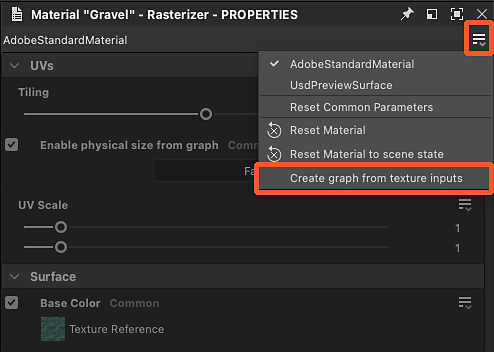
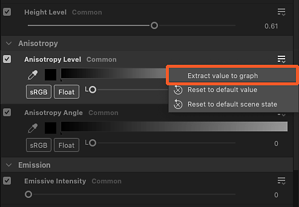
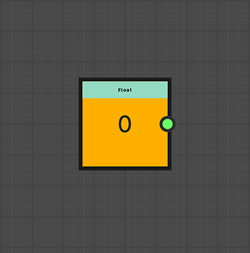

# Extracting materials values and textures

The properties of materials can be extracted to be used in Substance graphs.

<table>
<tr style="border: 0;">
<td style="border: 0;" valign="top">

## New graph from textures

</td>
<td style="border: 0;" valign="top">

### Extract texture

</td>
<td style="border: 0;" valign="top">

### Extract value

</td>
</tr>
</table>

## New graph from textures

The ‘Create graph from texture inputs action’ creates a new Substance graph with all the textures used by a material

A few things happen when using this action:

* A Substance graph named after the material is created at the selected location.
* A [bitmap resource](../../help/resources/bitmap-resource/bitmap-resource.md) is created for every texture used by the material, and placed in a folder named after the material, under a ‘Resources’ folder.
* In the graph, [Bitmap](../../help/compositing-graphs/nodes-reference-for-com/atomic-nodes/bitmap/bitmap.md) nodes are created for each of these bitmap resources and automatically connected to [Output](../../help/compositing-graphs/nodes-reference-for-com/atomic-nodes/output/output.md) nodes configured after the material properties using textures.
* If each channel of a same texture is used to drive different material properties (the technique is called [channel packing](../../help/glossary/glossary.md)), [Grayscale conversion](../../help/compositing-graphs/nodes-reference-for-com/atomic-nodes/grayscale-conversion/grayscale-conversion.md) nodes are automatically added to select appropriate channels.
* The graph is automatically connected to the material and its appearance should not change until you make edits in the graph.

<table>
<tr style="border: 0;">
<td style="border: 0;" valign="top">

{zoomable="yes"}

*Action in 3D View viewport*

</td>
<td style="border: 0;" valign="top">

{zoomable="yes"}

*Action in Materials menu*

</td>
<td style="border: 0;" valign="top">

{zoomable="yes"}

*Action in Properties dock*

</td>
</tr>
</table>

{zoomable="yes"}

*Result of graph creation from material textures*

+++Demonstration
{zoomable="yes"}

+++

>[!TIP]
>
> You can access the action quickly and directly in the 3D View viewport, by placing the cursor on the object and pressing <b>Shift+LMB</b> to select it. then clicking RMB to access a contextual menu hosting the action.

>[!NOTE]
>
> For formats using *embedded textures* (E.g.: USDZ), the textures need to be extracted and copied on disk. This results in an additional step to select the location that the textures should be extracted to.

## Extract texture

The ‘Extract texture to graph’ action creates a new Bitmap node in an existing graph for a texture used by a material.

A few things happen when using this action:

* A [bitmap resource](../../help/resources/bitmap-resource/bitmap-resource.md) is created for the texture used by the material, and placed in a folder named after the material, under a ‘Resources’ folder.
* In the selected graph, a [Bitmap](../../help/compositing-graphs/nodes-reference-for-com/atomic-nodes/bitmap/bitmap.md) node is created for that bitmap resource and automatically connected to an [Output](../../help/compositing-graphs/nodes-reference-for-com/atomic-nodes/output/output.md) node configured after the material property using that textures.

If an Output configured for the material property *already exists* in the graph, then *no nodes are created* and only the bitmap resource creation is performed.

E.g.: Extracting a texture for the ‘Base color’ property to a graph already hosting an Output node configured for ‘Base color’ will result in no nodes created in the graph.

<table>
<tr style="border: 0;">
<td style="border: 0;" valign="top">

{zoomable="yes"}

Action for material property in Properties dock

</td>
<td style="border: 0;" valign="top">

{zoomable="yes"}

'Select destination graph' dialog

</td>
<td style="border: 0;" valign="top">

</td>
</tr>
</table>

{zoomable="yes"}

Result of the texture extraction

+++Demonstration
{zoomable="yes"}

+++

The ‘Extract texture as resource’ action only creates a bitmap resource for the texture used by the material, and places it in a folder named after the material, under a ‘Resources’ folder.

>[!NOTE]
>
> For formats using *embedded textures* (E.g.: USDZ), the texture needs to be extracted and copied on disk. This results in an additional step to select the location that the texture should be extracted to.

## Extract value

The ‘Extract value to graph’ action creates a new [Value processor](../../help/compositing-graphs/nodes-reference-for-com/atomic-nodes/value-processor/value-processor.md) node in an existing graph for a material property value.

A few things happen when using this action:

* In the selected graph, a [Value processor](../../help/compositing-graphs/nodes-reference-for-com/atomic-nodes/value-processor/value-processor.md) node is created for that property value and automatically connected to an [Output](../../help/compositing-graphs/nodes-reference-for-com/atomic-nodes/output/output.md) node configured after that material property.
* In the Value processor node’s [Substance function graph](../../help/function-graphs/function-graphs.md), a [constant node](../../help/function-graphs/nodes-reference-for-fun/atomic-function-nodes/constant-nodes/constant-nodes.md) matching the value type is created, set to the extracted value as set as the graph’s output.

If an Output configured for the material property *already exists* in the graph, then *no nodes are created*.

E.g.: Extracting a value for the ‘Anisotropy level’ property to a graph already hosting an Output node configured for ‘Anisotropy level’ will result in no nodes created in the graph.

<table>
<tr style="border: 0;">
<td style="border: 0;" valign="top">

{zoomable="yes"}

Action for material property in Properties dock

</td>
<td style="border: 0;" valign="top">

{zoomable="yes"}

'Select destination graph' dialog

</td>
<td style="border: 0;" valign="top">

{zoomable="yes"}

Constant node in Value processor node's function

</td>
</tr>
</table>

{zoomable="yes"}

Result of the value extraction

+++Demonstration
{zoomable="yes"}

+++
