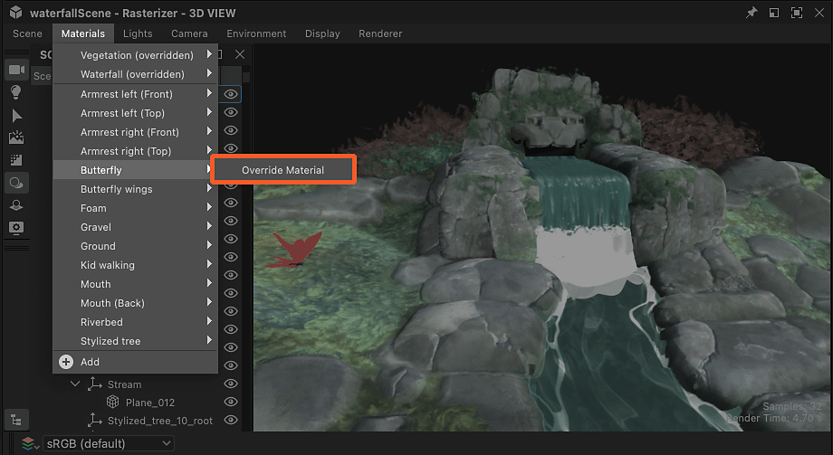
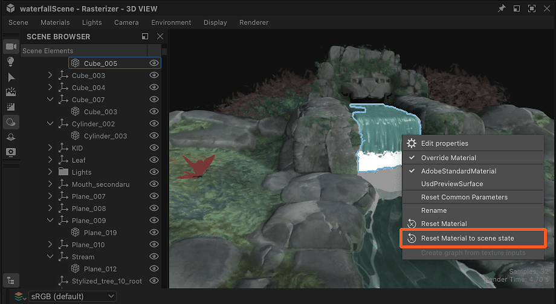

# Overriding scene materials

When working with 3D scenes with existing materials, it is necessary to override these materials in order to replace them with your own.

Your material can be built from scratch, or an adjusted version of a scene's material which has been [extracted into a Substance graph](../../working-with-3d-scenes/extracting-materials-val/extracting-materials-values-and-textures.md).

{zoomable="yes"}

<table>
<tr style="border: 0;">
<td style="border: 0;" valign="top">

## Override scene material

</td>
<td style="border: 0;" valign="top">

### Reset to scene state

</td>
<td style="border: 0;" valign="top">

### Connected material

</td>
</tr>
</table>

## Override scene material

Any material used in a scene can be overridden with your own version, that being a new material or an edited version of the existing material.

The 'Override material' action can be found in two places:

* Open the 'Materials' menu and go to the desired material's submenu
* Press Shift+LMB on a scene object to select it, then click RMB to open its contextual menu

<table>
<tr style="border: 0;">
<td style="border: 0;" valign="top">

{zoomable="yes"}

*Action in 3D View viewport*

</td>
<td style="border: 0;" valign="top">

{zoomable="yes"}

*Action in Materials menu*

</td>
</tr>
</table>

In the context of Designer, which uses USD for its internal scene description, overriding means *creating a copy* of the material which matches the original as closely as possible, and changing the *material binding* of the scene’s meshes from the original to the copy.

>[!NOTE]
>
> The copies are created in the scene in a ‘<b>material</b>’ folder (‘Scope’ in USD) under the root and use the same identifier as the original plus a numeric suffix (E.g.: ‘rustedMetal\_0’)

That means two important things:

1. The original material is never changed in any way.
1. Any work done in Designer will be applied to the copy.

You can toggle any override on and off at any point through the same 'Override material' action, if you wish to restore the original scene’s material or perform a quick before-and-after check as you go

Considering the copy is created to match the original, overriding a material should not change its appearance in most cases (see Note below), until you connect a Substance graph to it or edit its properties.

>[!NOTE]
>
> When an override is applied, Designer computes the tangents and binormals of the impacted meshes, which may take some time and change the aspect of those meshes, especially if those meshes have no defined normal scale and bias, or use different ones.

>[!IMPORTANT]
>
> The <b>AdobeStandardMaterial</b> shading model is supported across the Substance 3D ecosystem, but is not industry standard and therefore *may not be supported* by third party applications, such as Blender.
> 
> For the best interoperability outside Substance 3D applications, it is currently recommended to use the <b>UsdPreviewSurface</b> shading model, even if that model supports far less material properties and effects.

## Reset to scene state

If you need to go back to a material’s initial state, while keeping it overridden and still being able to edit it, any material copy can be reset to its initial values.

If a material property value was modified, or a texture from a graph was applied to it, the property is reverted to its initial value or texture.

A material can be reset entirely, or per property.

Use the ‘Reset material to scene state’ action in the material’s submenu or a mesh’s contextual menu, to reset the material entirely.

The action can be found in three places:

* Open the 'Materials' menu and go to the desired material's submenu
* Press Shift+LMB on a scene object to select it, then click RMB to open its contextual menu
* The hamburger menu at the top of that material's properties

<table>
<tr style="border: 0;">
<td style="border: 0;" valign="top">

{zoomable="yes"}

*Action in 3D View viewport*

</td>
<td style="border: 0;" valign="top">

{zoomable="yes"}

*Action in Materials menu*

</td>
<td style="border: 0;" valign="top">

{zoomable="yes"}

*Action in material's properties*

</td>
</tr>
</table>

<table>
<tr style="border: 0;">
<td style="border: 0;" valign="top">

The action is also available *per property* in the material properties, in case you want to reset only some aspects of a material.

Open the material property's hamburger menu to find the 'Reset to default scene state' action.

</td>
<td style="border: 0;" valign="top">

{zoomable="yes"}

</td>
</tr>
</table>

## Connected material

Again: Designer does not directly alter a scene’s material, it creates a copy in the scene and binds the meshes to that copy instead of the original.

On another hand, Designer has *its own* separate list of materials in its ‘Materials’ menu which matches the scene’s list of materials by default. You may add new materials in that list at any time.

This is a *different* set of data which is authored and managed in Designer only. These materials are then *connected to the copies* which override the scene’s original materials.

{zoomable="yes"}

You can connect any of the materials listed in the ‘Materials’ menu to the copies created by Designer in the scene: Click RMB on a copy in the Scene browser and going to the ‘Connect material’ submenu.

The submenu lists all materials in the scene and any materials you may have manually created from the ‘Materials’ menu.

{zoomable="yes"}
