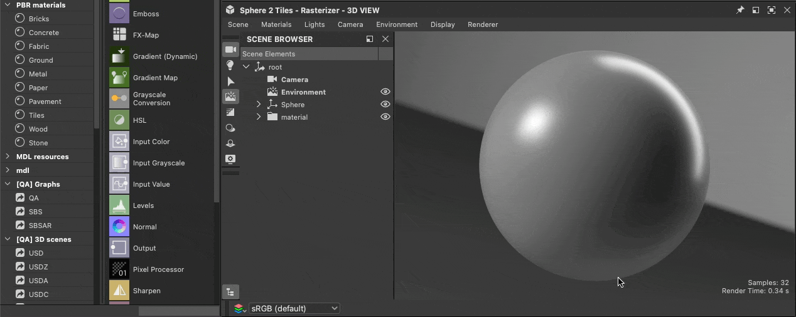
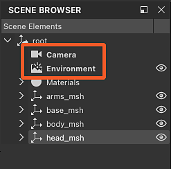
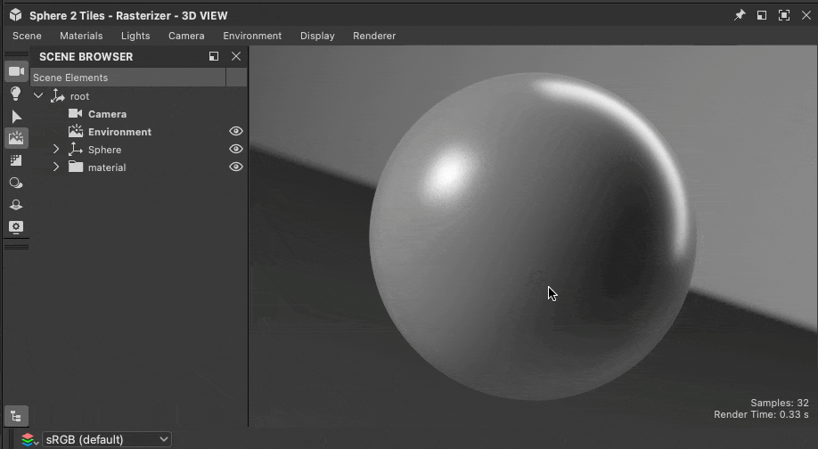

# Working with 3D scenes

{zoomable="yes"}

Designer lets you load [3D scenes](../glossary/glossary.md) to work on materials in context. You can find a list of supported file formats for 3D scenes here, including a list of supported features for each format. <b>&lt;link needed&gt;</b>

Working in context involves [overriding](../working-with-3d-scenes/overriding-scene-mat/overriding-scene-materials.md) one of the scene’s [materials](../glossary/glossary.md) to replace it with a material authored in Designer.  
You may start from scratch using any of the Substance graph templates available in Designer or [extract values and textures](../working-with-3d-scenes/extracting-materials-val/extracting-materials-values-and-textures.md) from the 3D scene’s material as a starting point.

When you are done with the 3D scene, you can [export it](../working-with-3d-scenes/exporting-scenes/exporting-scenes.md) to a new file to be ingested in another application.

When exporting to USD formats., this workflow can be entirely <b>non-destructive</b>, meaning that only edits and additions are exported.

First, you need to load a 3D scene to work on and be able to retain its state in Designer across sessions.

<table>
<tr style="border: 0;">
<td style="border: 0;" valign="top">

## Contents of 3D scenes

</td>
<td style="border: 0;" valign="top">

### Loading a scene

</td>
<td style="border: 0;" valign="top">

### scene state files

</td>
</tr>
</table>

## Contents of 3D scenes

When loading a 3D scene, Designer created its own scene to host it.

You can interact with following contents of the scene:

* <b>Materials:</b> all materials used in the scene can be [overridden](../working-with-3d-scenes/overriding-scene-mat/overriding-scene-materials.md) with a copy created by Designer. You may edit the [material properties](../interface/3d-view/material-properties/material-properties.md) of that copy, with raw values or textures from a Substance graph.
* <b>Meshes:</b> the geometry can be picked directly in the viewport or from the [Scene browser](../interface/3d-view/scene-browser/scene-browser.md), to access its material actions ([override](../working-with-3d-scenes/overriding-scene-mat/overriding-scene-materials.md), [reset](../working-with-3d-scenes/overriding-scene-mat/overriding-scene-materials.md), [extract to Substance graph](../working-with-3d-scenes/extracting-materials-val/extracting-materials-values-and-textures.md))
* <b>Lights:</b> all lights in the scene can be disabled in the [Scene browser](../interface/3d-view/scene-browser/scene-browser.md).
* <b>Cameras:</b> any camera detected in the scene is added as a preset to the camera added by Designer.

{zoomable="yes"}

Designer uses a USD description for its 3D scene. Its layout can be navigated in the Scene browser, where each [USD prim](https://openusd.org/release/glossary.html#usdglossary-prim) type has its own icon (geometry, material, shader, camera, transform, ...).

The [Scene browser](../interface/3d-view/scene-browser/scene-browser.md) can be used to select, enable and disable the contents of the scene. Therefore, we recommend you keep it displayed when working with custom 3D scenes.

## Loading a scene

There are several pathways to load a 3D scene in the 3D View:

1. Double-click or drag a [3D scene resource](../resources/3d-scene-resource/3d-scene-resource.md) from a [package](../glossary/glossary.md) into the 3D View
1. Drag a 3D scene item from the [Library](../interface/the-library/the-library.md) into the 3D View (provided you have [added your own content to the Library](../interface/the-library/managing-custom-content/managing-custom-content-and-filters.md))
1. Drag a 3D scene file from the system’s file browser into the 3D View
1. Load a 3D scene state file (SBSSCN) along with its referenced mesh

Note that only methods 1 and 4 let you load the scene again exactly as it was when you last worked on it, as the state of the scene is written in the 3D scene resource and scene state file and saved in the package. Methods 2 and 3 load the scene as any other.

<table>
<tr style="border: 0;">
<td style="border: 0;" valign="top">

{zoomable="yes"}

Loading a 3D scene resource

</td>
<td style="border: 0;" valign="top">

{zoomable="yes"}

Loading a 3D scene from the Library

</td>
</tr>
</table>

<table>
<tr style="border: 0;">
<td style="border: 0;" valign="top">

{zoomable="yes"}

Loading a 3D scene file

</td>
<td style="border: 0;" valign="top">

{zoomable="yes"}

Loading an scene state file

</td>
</tr>
</table>

>[!NOTE]
>
> Navigating and visualizing the scene in the 3D View is covered in the [3D View documentation](../interface/3d-view/3d-view.md).

<table>
<tr style="border: 0;">
<td width="100.00%" style="border: 0;" valign="top">

Designer always creates its own environment (DomeLight in USD) and camera in addition to those which may exist in the scene.

Any items created by Designer are listed with <b>bold labels</b> in the Scene browser.

>[!NOTE]
>
> When a loaded scene has at least one environment (DomeLight), the environment created by Designer is *disabled by default* so it does not interfere with the scene's environment lighting.

</td>
<td width="33.33%" style="border: 0;" valign="top">

{zoomable="yes"}

</td>
</tr>
</table>

## Scene state files

After setting up a materials, camera, lights, etc. in the 3D View, that state can be saved to a scene state file (.sbsscn) which may be loaded later to restore that state. For instance, you may want to set up a few scenes for previewing different types of materials, or a specific lighting environment.

{zoomable="yes"}

A saved scene state may also be used as the default state for the 3D View, so that any time a new 3D View is created, that state will be used. This is useful if you want to preview materials your materials by default on the Sphere 2-Tiles mesh with a tiling value of 2 and a specific environment map.

The actions related to scene state files are located in the Scene menu of the 3D View, and are documented [here](../interface/3d-view/3d-view.md).

Scene state files use the XML format and make use of [aliases](../pipeline-and-project-con/project-configuration-fil/project-configuration-files-sbsprj.md) if any are defined in your [project settings](../interface/preferences-window/project-settings/project-settings.md).

>[!NOTE]
>
> The renderer is not saved to scene state file.
